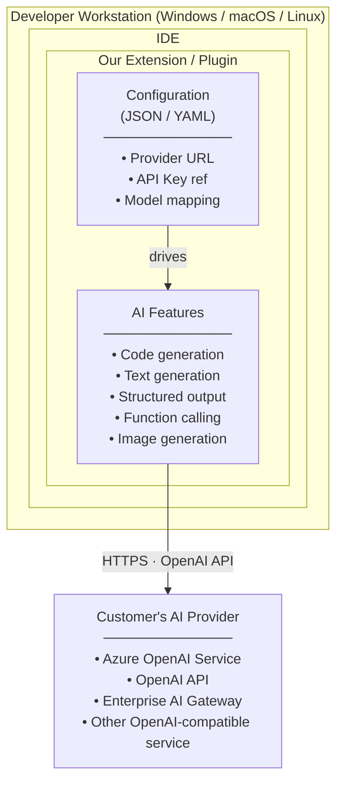
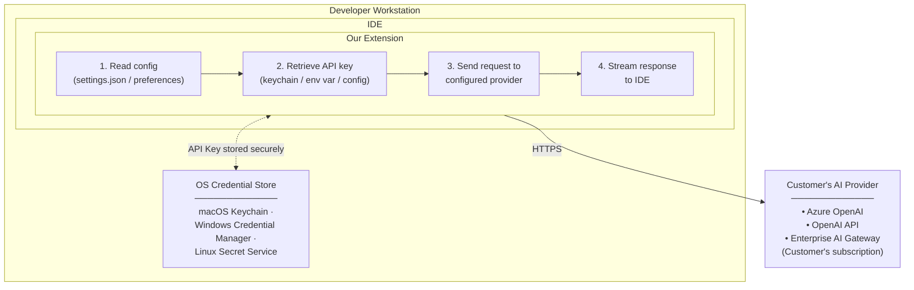
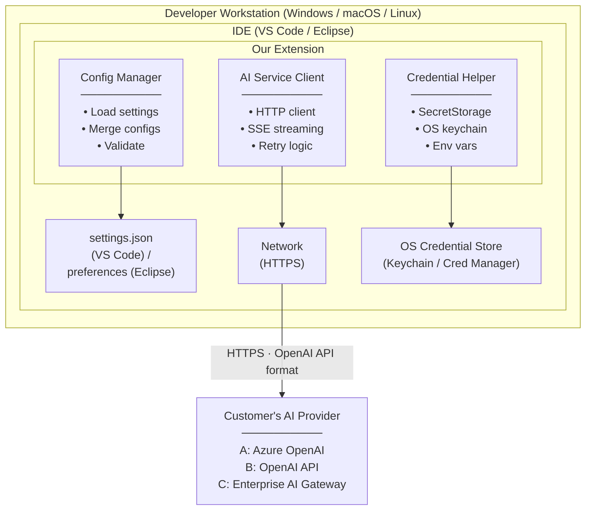
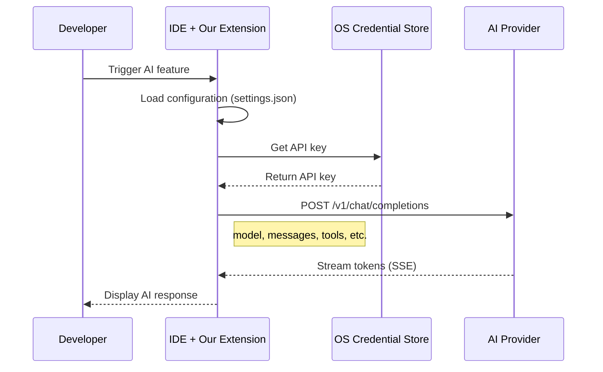
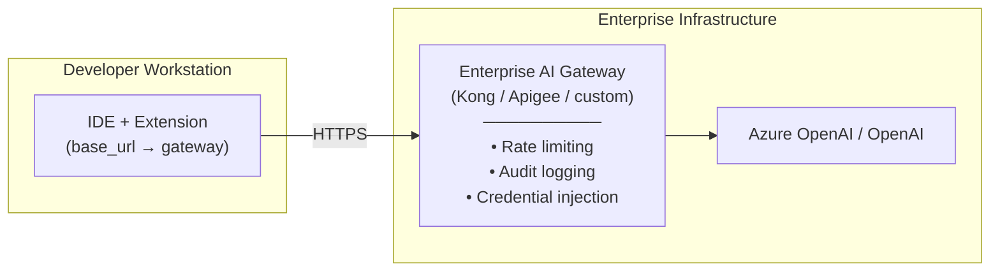
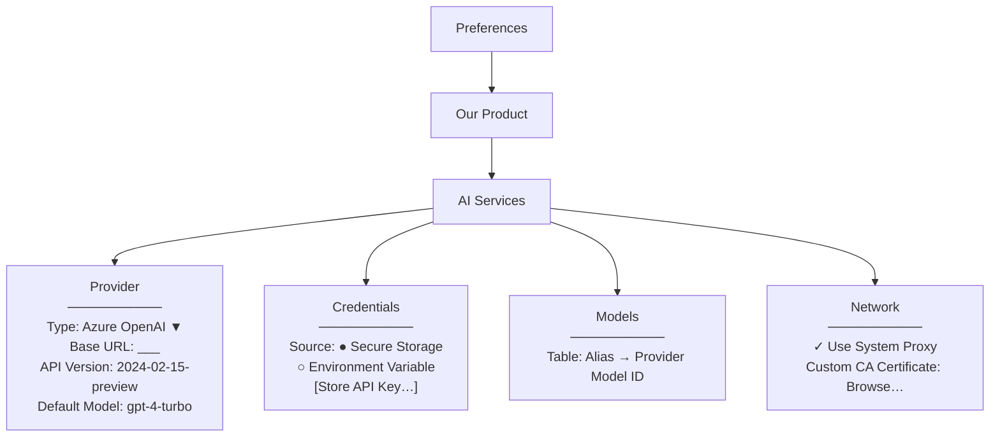
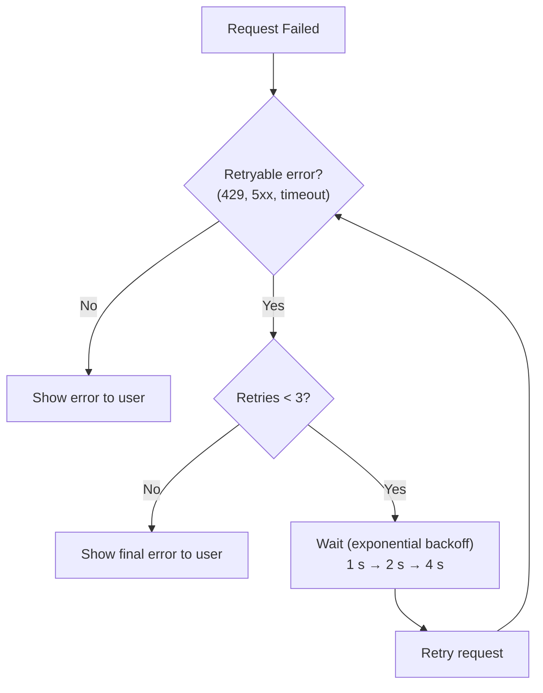

# AI Client SRS (Software Requirements Specification): OpenAI-Compatible AI Service Provisioning

**Document Status:** Draft  
**Version:** 0.16  
**Last Updated:** 2026-02-26  
**Target Audience:** Engineering, DevOps, QA, Product  
**Reference Spec:** [OpenAI API Reference](https://platform.openai.com/docs/api-reference) | [OpenAI Concepts](https://platform.openai.com/docs/concepts) | [Model Context Protocol](https://modelcontextprotocol.io/)

---

## 1. Executive Summary

### Context

We are an enterprise software vendor providing development tools to enterprise customers. Our products—VS Code extensions, Eclipse plugins, and other IDE integrations—are installed on **developer workstations and laptops** (Windows, macOS, Linux). We are incorporating Generative AI features into these tools and need to provide flexibility for customers to configure any OpenAI API-compliant cloud service while maintaining enterprise-grade security and administrative control.

### Strategic Rationale

A key driver for this architecture is **reducing friction in the evaluation phase of the sales cycle**. Prospective customers evaluating our AI-powered tools should not be required to stand up AI gateways, deploy proxy infrastructure, or configure enterprise middleware before they can experience the product's value. The only prerequisites should be:

1. **An API key** (BYOK — Bring Your Own Key) for any OpenAI-compatible cloud service (OpenAI, Azure OpenAI, etc.)
2. **Network access** to that service from the developer's workstation

This "zero-infrastructure" evaluation path lets prospects go from installation to first AI interaction in minutes, not weeks—removing a common deal blocker in enterprise sales cycles where IT approval for infrastructure changes can stall evaluations indefinitely.

At the same time, the architecture provides a **clear graduation path to enterprise-grade AI governance**. When a customer moves from evaluation to production deployment, they can introduce an enterprise AI gateway, SSO, centralized policy controls, and observability—all through configuration changes alone, with **zero code modifications** to the extension (see §7.4 — Gateway Graduation). This dual-track design ensures we win evaluations quickly while meeting the security and compliance bar required for enterprise procurement.

### Deployment Model



### Solution

This project establishes a standardized client-side configuration framework for accessing OpenAI API-compliant cloud services from our IDE extensions. Configuration follows IDE best practices (JSON/YAML) and supports:

- **Provider Flexibility:** Configure any OpenAI API-compatible endpoint (Azure OpenAI, OpenAI, Anthropic Claude, enterprise gateways, or self-hosted Ollama)
- **Enterprise Control:** IT administrators can deploy managed configuration profiles
- **User Customization:** Individual developers can override settings where permitted
- **Cross-Platform:** Consistent configuration across Windows, macOS, and Linux

### Supported Use Cases

| Use Case | API Endpoint / Protocol | Status |
|----------|------------------------|--------|
| **Text Generation** | `/v1/chat/completions` | ✅ In Scope |
| **Code Generation** | `/v1/chat/completions` | ✅ In Scope |
| **Structured Output** | `/v1/chat/completions` (JSON mode) | ✅ In Scope |
| **Function Calling** | `/v1/chat/completions` (tools) | ✅ In Scope |
| **Image Generation** | `/v1/images/generations` | ✅ In Scope (limited: single image generation only; batch generation, image editing, and variations not supported in v1) |
| **Model Context Protocol (MCP)** | MCP Server via `vscode.lm` API | ✅ In Scope (v0.7) |
| **BYOK / SecretStorage** | VS Code `SecretStorage` API | ✅ In Scope (v0.7) |
| **Enterprise SSO** | `vscode.authentication` provider | ✅ In Scope (v0.7) |
| Agents / Assistants API | `/v1/assistants/*` | ❌ Out of Scope |
| Embeddings | `/v1/embeddings` | ⚠️ Future |
| Audio/Speech | `/v1/audio/*` | ❌ Out of Scope |

### Value Proposition

| Stakeholder | Value Delivered |
|-------------|-----------------|
| **Enterprise IT** | Centrally manage AI provider configuration; enforce approved endpoints |
| **Developers** | AI features work out-of-the-box with their organization's approved provider |
| **Security Teams** | No hardcoded credentials; supports enterprise credential management |
| **Our Product** | Single codebase works with any OpenAI-compatible provider |
| **Our Engineering** | No per-provider code paths; configuration-driven provider selection |

---

## 2. Problem Statement & User Personas

### Problem Statement

Our enterprise customers evaluating AI-powered features in our IDE extensions face configuration and control challenges:

| Challenge | What Customers Tell Us | Our Impact |
|-----------|------------------------|------------|
| **Provider Lock-in** | "We have an Azure OpenAI contract; your tool must work with Azure, not just OpenAI" | Lost deals if we only support one provider |
| **Configuration Complexity** | "Every developer configures AI differently; we need consistency across 5,000 seats" | Support burden; inconsistent user experience |
| **Credential Management** | "We can't have API keys in plaintext settings files checked into repos" | Security review failures |
| **No Central Control** | "We need to push approved AI configurations to all developer machines" | IT cannot enforce policies |
| **Cross-Platform** | "Our developers use Windows, Mac, and Linux—config must work on all" | Platform-specific solutions are costly |

### The Opportunity

By building flexible, enterprise-manageable AI configuration:

- **Unlock Azure-first customers:** Large enterprises with existing Azure OpenAI deployments
- **Reduce support burden:** Consistent configuration patterns reduce "it doesn't work" tickets
- **Pass security reviews:** No hardcoded credentials; enterprise credential patterns supported
- **Enable IT control:** Managed configuration profiles for enterprise-wide deployment

### User Personas

#### Customer-Side Personas

| Persona | Role | Context | Primary Need |
|---------|------|---------|--------------|
| **IT Administrator** | Manages developer tooling | Rolling out our extension to 500+ developers | "Let me define one configuration and push it to all machines" |
| **Security Engineer** | Reviews developer tools | Evaluating our extension for approval | "Show me API keys are not stored in plaintext; show me the data flow" |
| **Developer (Power User)** | Uses AI features extensively | Wants to customize model settings | "Let me use a different model for certain tasks, if IT allows" |
| **Developer (Typical)** | Uses AI features casually | Just wants it to work | "I don't want to configure anything; it should just work with our company's AI" |

#### Internal Personas

| Persona | Role | Primary Need |
|---------|------|--------------|
| **Product Manager** | Owns AI feature adoption | Unblock enterprise deals with flexible provider support |
| **Extension Developer** | Builds VS Code/Eclipse plugins | Clean API to call AI services without provider-specific code |
| **Solutions Engineer** | Supports enterprise customers | Clear configuration docs; managed deployment options |
| **Technical Writer** | Creates user/admin docs | Configuration reference for all platforms and IDEs |

---

## 3. Goals & Success Metrics

### Goals

1. **Provider Flexibility:** Support any OpenAI API-compatible service (Azure OpenAI, OpenAI, enterprise gateways) via configuration
2. **IDE-Native Configuration:** Configuration follows IDE best practices (VS Code `settings.json`, Eclipse preferences)
3. **Enterprise Manageability:** IT can deploy and manage configuration profiles across developer machines
4. **User Customization:** Developers can override settings where IT policy permits
5. **Cross-Platform Consistency:** Same configuration schema works on Windows, macOS, and Linux

### Success Metrics

| Metric | Baseline | Target | Measurement Method |
|--------|----------|--------|-------------------|
| Enterprise deals unblocked | 0 | 15+ in Q1 | CRM win/loss tracking (blocked by provider restrictions) |
| Time to first AI feature use | Varies | < 5 minutes | User telemetry (opt-in) |
| Configuration-related support tickets | N/A | < 5% of installs | Support ticket analysis |
| Security review pass rate | 40% | 95% | Enterprise security questionnaire approvals |
| Providers validated | 1 (OpenAI) | 4+ | QA test matrix (Azure, OpenAI, vLLM, enterprise gateway) |

---

## 4. Assumptions & Dependencies

### Assumptions

| ID | Assumption | Risk if Invalid |
|----|------------|-----------------|
| A-01 | Customers have access to an OpenAI API-compatible service (Azure OpenAI, OpenAI, or enterprise gateway) | Must provide guidance on provider setup |
| A-02 | Developer workstations can reach the AI provider endpoint (directly or via corporate proxy) | Must support proxy configuration |
| A-03 | Target providers implement OpenAI API v1 specification | Azure OpenAI ✅, OpenAI ✅, most enterprise gateways ✅ |
| A-04 | IT administrators have mechanisms to deploy configuration to developer machines (GPO, MDM, config management) | Central config management is optional enhancement |
| A-05 | VS Code and Eclipse support our extension's settings schema | Standard extension settings mechanisms exist |

### Dependencies (Internal Engineering)

| Dependency | Owner | Status | Risk if Delayed |
|------------|-------|--------|-----------------|
| Configuration schema design | Extension Team | 🟡 In Progress | Cannot finalize settings documentation |
| VS Code settings integration | VS Code Team | 🟢 Complete | Basic extension settings work |
| Eclipse preferences integration | Eclipse Team | 🟡 In Progress | Eclipse users cannot configure AI |
| Credential storage via SecretStorage | Platform Team | 🟢 Complete (v0.7) | Credentials stored in OS-level secure storage via VS Code API |
| HTTP client with proxy support | Platform Team | 🟢 Complete | Corporate proxy environments blocked |
| Central config profile system | Platform Team | 🔴 Not Started (v1.1) | No managed configuration option |

### Customer-Side Prerequisites

| Prerequisite | Customer Responsibility | We Provide |
|--------------|------------------------|------------|
| AI Provider Access | Provision Azure OpenAI or obtain OpenAI API access | Configuration examples per provider |
| API Credentials | Obtain API key from their provider | Secure storage guidance |
| Network Access | Ensure workstations can reach provider endpoint | Proxy configuration documentation |
| (Optional) Config Distribution | Deploy settings to developer machines | Settings schema documentation |

---

## 5. Data Flow & Security

### Data Flow Architecture

Our extension runs on the developer's workstation and communicates directly with the customer's configured AI provider:



### What We (the Vendor) See

| Data Type | Do We See It? | Notes |
|-----------|---------------|-------|
| Prompts / Code | ❌ No | Sent directly from workstation to customer's provider |
| Completions | ❌ No | Returned directly from provider to workstation |
| API Keys | ❌ No | Stored on customer's machine; never transmitted to us |
| Configuration | ❌ No | Local to customer's machines |
| Usage Telemetry | ⚠️ Only if opted-in | Optional, anonymized telemetry for product improvement |

### Security Considerations

| Concern | How We Address |
|---------|----------------|
| **API Key Storage** | Support OS credential stores (Keychain, Credential Manager, Secret Service); discourage plaintext in settings |
| **Credential Leakage** | API keys never logged; not included in error reports |
| **Network Security** | HTTPS required for provider communication; proxy support for corporate networks |
| **Configuration Security** | Settings can be scoped to user or workspace; sensitive fields marked appropriately |

### Enterprise Security Patterns

| Pattern | Support |
|---------|---------|
| **Corporate Proxy** | HTTP_PROXY, HTTPS_PROXY environment variables; IDE proxy settings |
| **Certificate Pinning** | Custom CA certificate configuration for enterprise PKI |
| **Credential Rotation** | Credentials fetched fresh; no caching that would delay rotation |
| **Audit Logging** | Provider-side logging (Azure OpenAI logs, OpenAI usage dashboard) |

---

## 6. Out of Scope (v1)

The following items are explicitly **not included** in the v1 release:

### Explicitly Out of Scope

| Item | Rationale | Future Version |
|------|-----------|----------------|
| **Agents / Assistants API** | Complex stateful interactions requiring persistent threads, file storage, and code interpreter runtime; fundamentally different architecture from v1 stateless tool-call model | Deferred indefinitely (requires separate architecture study) |
| **LangGraph / Agent Frameworks** | Local or remote agent runtimes (LangGraph, CrewAI, AutoGen) require stateful orchestration, Python runtimes, and human-in-the-loop UX patterns beyond v1 scope. The v1 tool-call loop (model-driven, stateless) provides agent-like behavior without an agent runtime. Architectural hedges in §7.6 preserve future optionality. | v2+ |
| **Audio/Speech APIs** | `/v1/audio/*` endpoints not needed for dev tools | N/A |
| **Embeddings API** | Search/RAG use cases deferred | v1.1 |

### Deferred to Future Versions

| Item | Rationale | Future Version |
|------|-----------|----------------|
| **Central Configuration Management** | Enterprise profile distribution from control point | v1.1 |
| **Admin Console / UI** | Configuration via JSON/YAML sufficient for v1 | v1.1 |
| **AWS Bedrock Native Auth (SigV4)** | Bedrock's native authentication uses AWS SigV4 signing, which requires an AWS SDK dependency. Customers can access Bedrock models via an enterprise AI gateway or Bedrock's OpenAI-compatible endpoint in v1. | v1.1 |
| **Usage Analytics Dashboard** | Customers use provider's own dashboards | v2 |
| **Prompt Templates / Library** | Would require content storage | v2 |

### Customer Responsibility

| Item | Notes |
|------|-------|
| **Content Filtering** | Configured at provider level (Azure Content Safety, OpenAI moderation) |
| **Usage Monitoring** | Use provider dashboards (Azure Portal, OpenAI Usage) |
| **Rate Limiting** | Provider-side limits; customer manages quotas with their provider |

---

## 7. VS Code Extension Design-Phase Requirements

> **Supersedes:** This section refines and supersedes earlier guidance on provider integration, credential storage, and tool/agent capabilities from prior SRS versions. Where conflicts exist, the requirements below take precedence.
>
> **Specifically supersedes:**
> - REQ-07 (OS credential stores) — now clarified as fallback to SecretStorage (REQ-52)
> - REQ-10 (no plaintext keys) — now refined as REQ-53 (no globalState/workspaceState)
> - REQ-14 (pass tools unmodified) — now refined as REQ-37/REQ-38 (tool definition and tool_choice support)
> - REQ-17 (proxy support) — now promoted to Must as REQ-63 with explicit HTTP_PROXY/HTTPS_PROXY env var support

As the development team moves into the **design phase** for the VS Code extension, the following requirements ensure the product remains **service-agnostic**, **secure**, and **ready for enterprise "graduation"** from evaluation to production.

### 7.1 Provider-Agnostic Interface (Wire Protocol)

**Requirement:** The extension must use a **Universal LLM Client** that communicates via the OpenAI Chat Completions wire format.

**Implementation:**

* **No vendor-specific SDKs** as the primary integration path. Do not depend on `@openai/openai` or `@anthropic-ai/sdk` directly. Use plain HTTP (Node.js `fetch` or equivalent) against the OpenAI-compatible REST surface.
* Target a configurable **`BASE_URL`** and **`MODEL_NAME`**.
* By default, `BASE_URL` should be editable in VS Code Settings (e.g., `https://api.openai.com/v1` for evaluation or `https://gateway.acme.com/v1` for enterprise).
* **URL Path Handling:** The `BASE_URL` must be the **complete base path** to which API-specific paths (e.g., `/chat/completions`, `/images/generations`) are appended. For Azure OpenAI, this includes the deployment: `https://<resource>.openai.azure.com/openai/deployments/<deployment-name>`. The extension appends `/chat/completions` (or other endpoint paths) to construct the full request URL.
* The extension must pass through custom headers and query parameters (e.g., Azure `api-version`) without hard-coding provider-specific logic.

### 7.2 Frictionless BYOK — Secure Key Storage

**Requirement:** Enable users to supply their own API keys without requiring backend infrastructure.

**Implementation:**

* Utilize the **VS Code `SecretStorage` API** (`context.secrets`) to persist API keys locally on the user's machine. **Never** store keys in `globalState`, `workspaceState`, or standard JSON settings files.
* Support **Header Injection**: The extension must allow custom authentication headers (e.g., `X-Api-Key`, `Authorization: Bearer …`) to be dynamically populated from `SecretStorage` at request time.
* Provide a first-run "Set API Key" command that writes to `SecretStorage` and confirms success.

### 7.3 Tooling & Agency (Model Context Protocol)

**Requirement:** Use the **Model Context Protocol (MCP)** as the standard for tool capabilities. **No local AI agent runtime is required.**

**Dual MCP Role:**

The extension serves two complementary MCP roles:

1. **MCP Server** — The extension registers as an MCP Server (via `vscode.lm.registerMcpServerDefinitionProvider`), exposing tools that *other* MCP hosts in the VS Code ecosystem (e.g., GitHub Copilot) can discover and invoke.
2. **Tool-Call Orchestrator** — For its *own* LLM interactions, the extension contains a lightweight orchestration loop that iteratively executes `tool_calls` returned by the cloud model via the Chat Completions API until the model produces a final text response.

Critically, the cloud-hosted model (e.g., GPT-4, Claude) acts as its own planner. The extension is a **stateless executor** — it does not run a local agent, reasoning framework, or planning engine. "Agent-like" multi-step behavior emerges from the model's native ability to emit `tool_calls` iteratively, with the extension mechanically executing and returning results.

**Implementation:**

* Register the extension as an **MCP Server** using the `vscode.lm.registerMcpServerDefinitionProvider` API.
* Expose extension-specific capabilities as **MCP Tools**, including (but not limited to):
  * `search_codebase` — workspace-wide text / symbol search
  * `run_unit_tests` — execute test suites and return results
  * `read_file_context` — read file contents with line ranges
* **MCP Tool Permission Model:** Tools exposed via MCP Server must be classified by risk level (`safe`, `read-only`, `write-only`, `destructive`). The extension must maintain an allowlist of external MCP hosts authorized to invoke each tool category. By default, only `safe` and `read-only` tools are externally visible. Destructive tools (e.g., `run_terminal_command`) are internal-only unless explicitly authorized.
* **Workspace Trust Integration:** In untrusted workspaces (per VS Code Workspace Trust API), the extension must disable tool execution, limit model interactions to read-only context (e.g., open file contents only), and suppress `run_unit_tests` and `run_terminal_command` tools entirely.
* **Reasoning vs. Execution model:** The cloud model is the brain (decides *what* to do). The extension is the hands (decides *how* to do it safely). The tool-call orchestration loop sends tool definitions to the model, executes any returned `tool_calls` locally via the VS Code Extension API, appends results as `tool` role messages, and re-calls the model — repeating until a final text response is produced or a maximum iteration limit is reached.
* **Tool Execution Path:** When the extension's own tool-call orchestrator invokes tools for its internal LLM interactions, it calls tool implementations **directly** (internal function calls), not via the MCP protocol. The MCP Server registration is solely for exposing tools to *external* MCP hosts (e.g., GitHub Copilot). This avoids protocol overhead and serialization round-trips for internal tool use.
* MCP tool definitions must include JSON Schema parameter descriptions to maximize model accuracy.
* The tool-call orchestration loop must be implemented as a **modular, replaceable component** (`ToolOrchestrator` interface) to support future substitution with more advanced orchestration backends (see §7.6).

### 7.4 Path to Enterprise — The Gateway Graduation

**Requirement:** The architecture must support a **zero-code-change transition** from direct SaaS access to enterprise-governed access.

**Implementation:**

* **SSO Integration:** Implement support for the `vscode.authentication` provider API. When a `BASE_URL` points to an enterprise gateway, the extension should attempt to exchange a VS Code session token for a gateway bearer token via OIDC / OAuth flow.
* **Telemetry & Observability:** Include a `X-Request-Id` header (UUID v4) in **all** outgoing LLM calls to allow enterprise IT to trace requests from the IDE through their AI Gateway and into the upstream provider.
* **Proxy awareness:** Respect VS Code's built-in proxy settings and `HTTP_PROXY` / `HTTPS_PROXY` environment variables for corporate network environments.

### 7.5 Evaluation ↔ Enterprise Specification Summary

| Component | Evaluation Requirement (BYOK) | Enterprise Requirement (Production) |
| --- | --- | --- |
| **Auth** | User-pasted key in `SecretStorage` | OIDC / OAuth via `vscode.authentication` |
| **Routing** | Direct to SaaS (OpenAI, Anthropic, Azure OpenAI) | Internal AI Gateway (Kong, Cloudflare, etc.) |
| **Protocol** | OpenAI-Compatible REST + MCP for Tools | OpenAI-Compatible REST + MCP for Tools |
| **Connectivity** | Public Internet (Node.js `fetch`) | Corporate VPN / Proxy aware |
| **Telemetry** | Optional opt-in | `X-Request-Id` tracing through gateway |
| **Key Storage** | VS Code `SecretStorage` | `SecretStorage` + SSO token exchange |

### 7.6 Future-Proofing: Architectural Hedges for Agent Frameworks

> **Context:** While local/remote agent frameworks (e.g., LangGraph, CrewAI) are explicitly **out of scope** for v1 (see §6), the following low-cost architectural hedges ensure the extension can adopt advanced orchestration in the future with minimal refactoring. These are *design constraints*, not features — they impose structure on v1 implementation to preserve optionality.

**1. Modular Tool Orchestrator**

* The tool-call loop (send tools → receive `tool_calls` → execute → return results → repeat) must be encapsulated behind a **`ToolOrchestrator` interface**. The v1 implementation is a simple iterative loop driven by Chat Completions `tool_calls`. In a future version, this interface could be swapped for a LangGraph-backed orchestrator or cloud-hosted agent endpoint — with no changes to the rest of the extension.

**2. Conversation Thread IDs**

* Every conversation or multi-turn interaction must be assigned a **`thread_id`** (UUID v4), even though v1 does not persist conversation state. This in-memory correlation ID maps directly to LangGraph's thread concept and enables future checkpointing, resume, and replay without retroactively adding identifiers.

**3. Event-Typed Streaming**

* The internal streaming layer must emit **typed events** rather than raw token strings. The v1 event types are: `token`, `tool_call`, `tool_result`, `status`, and `error`. Even though v1 consumers primarily use `token` events, this structure allows future agent orchestrators to emit additional event types (e.g., `plan_step`, `human_approval_needed`, `state_transition`) without breaking the streaming contract.

**4. Multi-Step UX Readiness**

* The UI layer must not assume that a single user action produces a single model response. The tool-call loop already breaks this assumption, but the UX components (progress indicators, output panels) must be designed to display **step-by-step progress** for multi-turn interactions. This ensures future agent workflows — which may involve planning, branching, and human-in-the-loop approvals — can surface their state in the existing UI framework.

---

## 8. System Architecture

### Component Overview

Our product is an **IDE extension** installed on developer workstations. It communicates directly with the customer's configured AI provider via the **Universal LLM Client** (see §7.1)—no intermediate backend or gateway required (though customers may optionally use an enterprise AI gateway).



### Request Flow



### Architecture Decisions

| Decision | Choice | Rationale |
|----------|--------|-----------|
| Runtime | IDE extension (no separate backend) | Simple deployment; standard extension install |
| LLM integration | Universal LLM Client via OpenAI-compatible REST (no vendor SDKs) | Service-agnostic; zero-code-change provider swap (§7.1) |
| Configuration | IDE-native settings (JSON/YAML) | Familiar to developers; supports IDE config sync |
| Credential storage | VS Code `SecretStorage` API (preferred); OS credential store fallback | Security best practice; avoids plaintext keys (§7.2) |
| Auth header | Dynamic header injection from `SecretStorage` | Supports `Authorization`, `X-Api-Key`, and custom headers |
| Provider communication | Direct HTTPS to provider (or enterprise gateway) | No middleman; simplest data flow; gateway-ready (§7.4) |
| Streaming | SSE (Server-Sent Events) | Real-time token display; standard OpenAI pattern |
| Agentic capabilities | Model Context Protocol (MCP) via `vscode.lm` API | Industry-standard tool protocol; hands/brain separation (§7.3) |
| Enterprise auth | `vscode.authentication` provider for SSO/OIDC | Zero-code-change graduation to enterprise gateway (§7.4) |
| Observability | `X-Request-Id` header on all outgoing calls | End-to-end tracing through enterprise AI gateways |
| Cross-platform | Single codebase for Win/Mac/Linux | Extension APIs abstract platform differences |

### Provider Type Behaviors

The `type` field in the provider configuration controls provider-specific behaviors:

| Provider Type | Auth Header | Path Construction | Default Headers | Notes |
|---------------|-------------|-------------------|-----------------|-------|
| `azure-openai` | `api-key` | `baseUrl` + `/chat/completions` + `?api-version=X` | `api-key: <from SecretStorage>` | Requires `api-version` in headers or query params |
| `openai` | `Authorization` | `baseUrl` + `/chat/completions` | `Authorization: Bearer <from SecretStorage>` | Standard OpenAI format |
| `anthropic` | `x-api-key` | `baseUrl` + `/chat/completions` | `x-api-key: <from SecretStorage>`<br/>`anthropic-version: 2023-06-01` | Uses Anthropic's OpenAI-compatible endpoint |
| `ollama` | None (optional) | `baseUrl` + `/chat/completions` | None | No auth by default; supports optional Bearer token if Ollama is secured |
| `openshift-ai` | `Authorization` | `baseUrl` + `/chat/completions` | `Authorization: Bearer <from SecretStorage>` | Uses Kubernetes service account or OAuth token |
| `bedrock` | N/A (v1.1) | N/A | N/A | Native SigV4 auth deferred; use via gateway or OpenAI-compatible endpoint |
| `compatible` | Configurable via `authHeaderName` | `baseUrl` + `/chat/completions` | User-specified via `authHeaderName` and `authMode` | Generic fallback for any OpenAI-compatible provider |

**Configurability:** Users can override the default auth header using the `authHeaderName` field in the provider configuration. When `authMode: "sso"` is set, the `vscode.authentication` provider is used instead of `SecretStorage`.

### Configuration Hierarchy

Configuration can be set at multiple levels, with higher levels overriding lower:

```mermaid
block-beta
    columns 1
    block:L4["4 · User Override (if permitted) — ~/.vscode/settings.json — ← Highest priority"]
    end
    block:L3["3 · Workspace Settings — .vscode/settings.json in project"]
    end
    block:L2["2 · Managed Configuration Profile (v1.1) — Deployed by IT via GPO / MDM"]
    end
    block:L1["1 · Extension Defaults — Built into extension — ← Lowest priority"]
    end

    L4 --> L3 --> L2 --> L1
```

### Optional: Enterprise AI Gateway

Some enterprises deploy a central AI gateway. Our extension supports this pattern:



### Supported Providers (v1)

| Provider | Compatibility | Configuration Notes |
|----------|---------------|---------------------|
| **Azure OpenAI** | ✅ Native | Set `base_url` to deployment; add `api-version` header |
| **OpenAI** | ✅ Native | Default; just provide API key |
| **Enterprise Gateways** | ✅ Native | Point `base_url` to gateway; gateway handles upstream |
| **Ollama** | ✅ Native | Self-hosted; point `base_url` to local instance (e.g., `http://localhost:11434/v1`) |
| **Anthropic Claude** | ✅ Via OpenAI-compatible endpoint | Set `base_url` to `https://api.anthropic.com/v1/`; BYOK with Anthropic API key. Uses Anthropic's OpenAI-compatible surface — no adapter or translation layer needed. |
| **Red Hat OpenShift AI** | ✅ Via OpenAI-compatible endpoint | Set `base_url` to the OpenShift AI model serving route (e.g., `https://<model-route>.apps.<cluster>/v1`). Uses KServe / vLLM runtime which exposes an OpenAI-compatible inference API. BYOK with the serving endpoint's bearer token. |
| **AWS Bedrock** | ⚠️ Conditional | Supported when accessed through Bedrock's OpenAI-compatible endpoint or an enterprise AI gateway that exposes an OpenAI-compatible surface. Native Bedrock SigV4 auth is **not** supported in v1; customers requiring direct Bedrock access without a gateway should use the gateway graduation path (§7.4). |

---

## 9. Prompt Engineering & API Patterns

This section defines how developers building features within our extensions should construct and manage AI interactions. These patterns ensure consistency, reusability, and reliable outputs.

### 9.1 Message Roles

The OpenAI Chat Completions API uses distinct message roles. Our extension SDK must properly support all roles:

| Role | Purpose | When to Use |
|------|---------|-------------|
| **system** | Sets behavior, persona, and constraints for the model | Once at the start of each conversation/request; defines "who" the AI is |
| **user** | Contains the actual user request or input | For prompts derived from user actions or code context |
| **assistant** | Contains previous AI responses | For multi-turn conversations; providing examples (few-shot) |

**Example: Programmatic Prompt Construction**

```typescript
// Code review feature - programmatic prompt (not interactive chat)
const messages: ChatMessage[] = [
  {
    role: "system",
    content: `You are a senior software engineer performing code review.
Focus on: security vulnerabilities, performance issues, and maintainability.
Be concise. Use bullet points. Do not rewrite the code unless asked.`
  },
  {
    role: "user", 
    content: `Review this code:\n\n\`\`\`${language}\n${codeSnippet}\n\`\`\``
  }
];
```

### 9.2 Prompt Templates

For reusable, programmatic prompts (not user-authored chat), the extension should support templated prompts:

**Template Structure**

```yaml
# Prompt template: code-review.yaml
id: code-review
name: "Code Review"
description: "Analyze code for issues and improvements"
version: "1.0"

system_prompt: |
  You are a senior software engineer performing code review.
  Focus on: {{focus_areas}}
  Language: {{language}}
  Be concise. Use bullet points.

user_prompt_template: |
  Review this {{language}} code:
  
  ```{{language}}
  {{code}}
  ```
  
  {{#if specific_concern}}
  Pay special attention to: {{specific_concern}}
  {{/if}}

parameters:
  - name: language
    type: string
    required: true
  - name: code
    type: string
    required: true
  - name: focus_areas
    type: string
    default: "security, performance, maintainability"
  - name: specific_concern
    type: string
    required: false

model_settings:
  temperature: 0.3  # Lower for more consistent analysis
  max_tokens: 1024
```

**Programmatic Usage**

```typescript
const result = await ai.executeTemplate("code-review", {
  language: "typescript",
  code: selectedText,
  focus_areas: "security, error handling",
  specific_concern: "SQL injection"
});
```

### 9.3 Instruction Following Best Practices

To ensure reliable model outputs, prompts should follow these patterns:

| Pattern | Description | Example |
|---------|-------------|---------|
| **Role Definition** | Clearly define who/what the model is | "You are a TypeScript expert..." |
| **Task Specification** | Explicitly state the task | "Your task is to refactor this function to..." |
| **Output Format** | Specify desired format | "Respond with a JSON object containing..." |
| **Constraints** | Define what NOT to do | "Do not include explanations. Only output code." |
| **Examples (Few-shot)** | Provide input/output examples | Include 1-3 examples in system or user message |

**Anti-patterns to Avoid**

| Anti-pattern | Problem | Better Approach |
|--------------|---------|-----------------|
| Vague instructions | Inconsistent outputs | Be specific: "List exactly 3 issues" |
| No output format | Hard to parse results | Always specify format |
| Overly long prompts | Token waste, confusion | Keep focused; use separate calls for different tasks |
| Prompt injection risk | User input may override instructions | Clearly delimit user content with markers |

### 9.4 Structured Output Handling

For features requiring parseable responses, use the `response_format` parameter or explicit JSON instructions:

**Method 1: JSON Mode (Recommended)**

```typescript
const response = await ai.complete({
  messages: [...],
  response_format: { type: "json_object" },
  // When using JSON mode, instruct the model what JSON to produce
});

// System prompt must mention JSON:
// "Respond with a JSON object containing: { issues: [...], summary: string }"
```

**Method 2: Explicit Schema in Prompt**

```typescript
const systemPrompt = `
Analyze the code and respond with this exact JSON structure:
{
  "issues": [
    {
      "severity": "high" | "medium" | "low",
      "line": number,
      "description": string,
      "suggestion": string
    }
  ],
  "overall_quality": "good" | "needs_work" | "poor",
  "summary": string
}

Respond ONLY with valid JSON. No additional text.
`;
```

**Response Parsing**

```typescript
interface CodeReviewResult {
  issues: Array<{
    severity: "high" | "medium" | "low";
    line: number;
    description: string;
    suggestion: string;
  }>;
  overall_quality: "good" | "needs_work" | "poor";
  summary: string;
}

const result = await ai.complete<CodeReviewResult>({
  messages,
  response_format: { type: "json_object" },
  responseSchema: CodeReviewResultSchema  // Runtime validation
});
```

### 9.5 Function Calling (Tools)

For features that need the model to invoke defined functions:

**Defining Tools**

```typescript
const tools: Tool[] = [
  {
    type: "function",
    function: {
      name: "get_file_contents",
      description: "Read the contents of a file in the workspace",
      parameters: {
        type: "object",
        properties: {
          file_path: {
            type: "string",
            description: "Relative path to the file"
          }
        },
        required: ["file_path"]
      }
    }
  },
  {
    type: "function",
    function: {
      name: "run_terminal_command",
      description: "Execute a terminal command. **WARNING:** This tool executes arbitrary commands and is classified as DESTRUCTIVE. Requires explicit user approval when `requireApprovalForDestructiveTools` is enabled. Not exposed to external MCP hosts by default.",
      parameters: {
        type: "object",
        properties: {
          command: { type: "string", description: "Shell command to execute" },
          working_directory: { type: "string", description: "Working directory (optional)" }
        },
        required: ["command"]
      }
    }
  }
];
```

**Handling Tool Calls**

```typescript
const response = await ai.complete({
  messages,
  tools,
  tool_choice: "auto"  // or "required" or { type: "function", function: { name: "..." } }
});

if (response.tool_calls) {
  for (const toolCall of response.tool_calls) {
    const args = JSON.parse(toolCall.function.arguments);
    
    // Execute the tool
    const result = await executeFunction(toolCall.function.name, args);
    
    // Send result back to model
    messages.push(
      { role: "assistant", content: null, tool_calls: [toolCall] },
      { role: "tool", tool_call_id: toolCall.id, content: JSON.stringify(result) }
    );
  }
  
  // Continue conversation with tool results
  const finalResponse = await ai.complete({ messages, tools });
}
```

### 9.6 Context Management

For features that incorporate workspace context (code, files, symbols):

| Context Type | How to Include | Token Considerations |
|--------------|----------------|----------------------|
| **Selected Code** | Include in user message with language markers | Count tokens; truncate if needed |
| **File Contents** | Include relevant portions, not entire files | Summarize or chunk large files |
| **Symbol Definitions** | Include type signatures, interfaces | Prioritize relevant symbols |
| **Error Messages** | Include full error with stack trace | May truncate very long traces |
| **Documentation** | Include relevant doc snippets | Use RAG pattern for large docs |

**Context Prioritization**

```typescript
interface ContextBuilder {
  // Add context with priority (higher = more important to keep)
  addContext(content: string, priority: number, label: string): void;
  
  // Build final context respecting token budget
  build(maxTokens: number): string;
}

const context = new ContextBuilder();
context.addContext(errorMessage, 100, "error");      // Highest priority
context.addContext(selectedCode, 90, "selection");    // High
context.addContext(fileContents, 50, "file");         // Medium
context.addContext(relatedTypes, 30, "types");        // Lower

const finalContext = context.build(4000);  // Fits in context window
```

---

## 10. Functional Requirements (EARS Syntax)

### Configuration

| ID | Priority | Requirement (EARS Format) |
|----|----------|---------------------------|
| **REQ-01** | Must | **The extension shall** read configuration from IDE-native settings (VS Code `settings.json`, Eclipse preferences). |
| **REQ-02** | Must | **The extension shall** support configuration in both JSON and YAML formats where the IDE permits. |
| **REQ-03** | Must | **The extension shall** allow configuration of `base_url` to any OpenAI API-compatible endpoint. |
| **REQ-04** | Must | **The extension shall** support model ID aliasing, mapping user-friendly names to provider model identifiers. |
| **REQ-05** | Must | **The extension shall** support configuration of custom headers (e.g., `api-version` for Azure OpenAI). |
| **REQ-06** | Should | **When** both user and workspace settings exist, **the extension shall** merge them with **workspace settings taking precedence** per VS Code convention (user settings as fallback). |

### Credential Management

| ID | Priority | Requirement (EARS Format) |
|----|----------|---------------------------|
| **REQ-07** | Must | **The extension shall** use VS Code `SecretStorage` API as the primary credential storage mechanism; **when** SecretStorage is unavailable (e.g., headless/container environments), **the extension shall** fall back to OS credential stores (macOS Keychain, Windows Credential Manager, Linux Secret Service) with a warning to the user about reduced security. |
| **REQ-07a** | Must | **When** both SecretStorage and OS credential stores are unavailable, **the extension shall** disable AI features requiring authentication and display a persistent warning: "Credential storage unavailable. AI features disabled. Use environment variables (OPENAI_API_KEY) as workaround." |
| **REQ-08** | Must | **The extension shall** support retrieving API keys from environment variables. |
| **REQ-09** | Should | **The extension shall** support API key entry via IDE-native secret input (masked input fields). |
| **REQ-10** | Must | **The extension shall not** store API keys in plaintext in settings files by default. |
| **REQ-11** | Must | **The extension shall** never include API keys in logs, error reports, or telemetry. |

### API Integration

| ID | Priority | Requirement (EARS Format) |
|----|----------|---------------------------|
| **REQ-12** | Must | **The extension shall** implement the OpenAI Chat Completions API (`/v1/chat/completions`). |
| **REQ-13** | Must | **The extension shall** support streaming responses via Server-Sent Events (SSE). |
| **REQ-14** | Must | **When** a request includes `tools` or `functions` parameters, **the extension shall** pass them unmodified to the provider. |
| **REQ-15** | Must | **When** `response_format: { "type": "json_object" }` is specified, **the extension shall** include it in the request. |
| **REQ-16** | Should | **The extension shall** support the Images API (`/v1/images/generations`) for image generation features. |
| **REQ-17** | Must | **The extension shall** support HTTP/HTTPS proxy configuration via IDE proxy settings and/or environment variables. |
| **REQ-93** | Must | **The extension shall** enforce network timeouts: 10 seconds for connection establishment, 60 seconds for streaming reads, 30 seconds for non-streaming reads. |
| **REQ-94** | Must | **When** a provider response exceeds 1MB, **the extension shall** truncate the response and display a warning: "Response truncated at 1MB. Consider using streaming or reducing request scope." |

### Concurrent Request Handling

| ID | Priority | Requirement (EARS Format) |
|----|----------|---------------------------|
| **REQ-79** | Must | **The extension shall** support multiple concurrent chat sessions without blocking or interference. |
| **REQ-80** | Should | **When** multiple requests are initiated simultaneously, **the extension shall** queue them and enforce per-provider rate limits to prevent throttling errors. |

### Provider Capability Detection

| ID | Priority | Requirement (EARS Format) |
|----|----------|---------------------------|
| **REQ-81** | Should | **The extension shall** detect provider support for vision/multimodal inputs via `/v1/models` endpoint or provider-specific capability metadata. |
| **REQ-82** | Should | **When** a provider does not support a requested feature (e.g., tool calling, vision), **the extension shall** gracefully degrade by disabling the feature and notifying the user. |
| **REQ-83** | Should | **The extension shall** cache provider capability information for the duration of the session to minimize redundant API calls. |

### User Experience

| ID | Priority | Requirement (EARS Format) |
|----|----------|---------------------------|
| **REQ-18** | Should | **When** configuration is incomplete, **the extension shall** prompt the user with guided setup. |
| **REQ-19** | Should | **The extension shall** provide a "Test Connection" command to validate provider connectivity. |
| **REQ-20** | Must | **When** an API error occurs, **the extension shall** display a user-friendly error message with troubleshooting guidance. |
| **REQ-21** | Must | **The extension shall** indicate streaming progress during AI response generation. |
| **REQ-21a** | Should | **When** a user is waiting for an AI response, **the extension shall** display a progress indicator showing elapsed time and estimated completion if streaming has not yet started. |

### Accessibility & Internationalization

| ID | Priority | Requirement (EARS Format) |
|----|----------|---------------------------|
| **REQ-95** | Must | **The extension shall** support keyboard-only operation: all AI commands accessible via Command Palette (VS Code) or menu shortcuts, no mouse-only features. |
| **REQ-96** | Must | **When** streaming AI responses, **the extension shall** announce status changes to screen readers ("Thinking...", "Generating response...", "Response complete") using ARIA live regions or platform equivalents. |
| **REQ-97** | Should | **The extension shall** use an i18n framework (e.g., `vscode-nls`, Eclipse NLS) with externalized strings in resource bundles, enabling future localization without code changes. |
| **REQ-98** | Should | **The extension shall** ship with English (en-US) locale in v1; message keys shall follow convention `extension.category.message` for easy translation in v1.1+. |

### Multi-Provider Configuration

| ID | Priority | Requirement (EARS Format) |
|----|----------|---------------------------|
| **REQ-84** | Should | **The extension shall** support configuration of multiple named provider profiles (e.g., "dev-azure", "prod-openai") in user or workspace settings. |
| **REQ-85** | Should | **The extension shall** provide a UI command or quick pick to switch the active provider profile at runtime. |

### Enterprise Management (v1.1)

| ID | Priority | Requirement (EARS Format) |
|----|----------|---------------------------|
| **REQ-22** | Won't (v1) | **The extension shall** support loading configuration profiles from a central management endpoint. |
| **REQ-23** | Won't (v1) | **When** managed configuration is deployed, **the extension shall** allow IT to lock certain settings from user override. |

> **Note:** REQ-24 through REQ-27 were removed during the v0.6 refactoring when prompt engineering requirements were reorganized. The requirement numbering gap is preserved for historical traceability.

### Prompt Construction & Message Roles

| ID | Priority | Requirement (EARS Format) |
|----|----------|---------------------------|
| **REQ-28** | Must | **The extension SDK shall** support all OpenAI message roles: `system`, `user`, `assistant`, and `tool`. |
| **REQ-29** | Must | **The extension SDK shall** provide a programmatic API for constructing message arrays without requiring user interaction. |
| **REQ-30** | Should | **The extension SDK shall** support prompt templates with variable substitution for reusable, parameterized prompts. |
| **REQ-31** | Should | **When** constructing prompts, **the extension SDK shall** provide utilities to estimate token counts before sending requests. |
| **REQ-32** | Should | **The extension SDK shall** support context prioritization, allowing developers to specify which context to retain when truncating for token limits. |

### Context Window Overflow Handling

| ID | Priority | Requirement (EARS Format) |
|----|----------|---------------------------|
| **REQ-86** | Should | **When** the constructed prompt exceeds 90% of the model's known context window, **the extension shall** warn the user before sending the request. |
| **REQ-87** | Should | **When** a provider returns a token limit error (e.g., HTTP 400 with `context_length_exceeded`), **the extension shall** automatically truncate the oldest non-system messages and retry once. |
| **REQ-88** | Should | **When** automatic truncation occurs, **the extension shall** notify the user that context was reduced and log which messages were removed. |

### Structured Output

| ID | Priority | Requirement (EARS Format) |
|----|----------|---------------------------|
| **REQ-33** | Must | **The extension SDK shall** support the `response_format: { type: "json_object" }` parameter for JSON mode. |
| **REQ-34** | Must | **When** JSON mode is requested, **the extension SDK shall** validate that the system prompt instructs the model to produce JSON. |
| **REQ-35** | Should | **The extension SDK shall** provide typed response parsing with runtime validation against a provided schema. |
| **REQ-36** | Should | **When** JSON parsing fails, **the extension SDK shall** provide a clear error indicating the parsing failure and include the raw response for debugging. |

### Function Calling (Tools)

| ID | Priority | Requirement (EARS Format) |
|----|----------|---------------------------|
| **REQ-37** | Must | **The extension SDK shall** support defining tools/functions with JSON Schema parameter definitions. |
| **REQ-38** | Must | **The extension SDK shall** support all `tool_choice` options: `auto`, `required`, `none`, and specific function selection. |
| **REQ-39** | Must | **When** the model returns `tool_calls`, **the extension SDK shall** provide the parsed function name and arguments. |
| **REQ-40** | Must | **The extension SDK shall** support sending tool results back to the model via the `tool` role message. |
| **REQ-41** | Should | **The extension SDK shall** provide a tool execution loop helper that handles multi-turn tool calling until completion. |

### Security & Privacy

| ID | Priority | Requirement (EARS Format) |
|----|----------|---------------------------|
| **REQ-42** | Must | **The extension shall** use HTTPS for all provider communication. |
| **REQ-43** | Must | **The extension shall** support custom CA certificates for enterprise PKI environments. |
| **REQ-44** | Must | **The extension shall not** send telemetry without explicit user opt-in. |
| **REQ-45** | Must | **The extension shall not** persist prompts, completions, or conversation history to disk (unless explicitly enabled for a feature). |
| **REQ-46** | Must | **When** constructing prompts with user-provided content, **the extension SDK shall** clearly delimit user content to reduce prompt injection risk. |

### Provider-Agnostic Interface (§7.1)

| ID | Priority | Requirement (EARS Format) |
|----|----------|---------------------------|
| **REQ-47** | Must | **The extension shall** use a Universal LLM Client that communicates exclusively via the OpenAI Chat Completions wire format (`/v1/chat/completions`). |
| **REQ-48** | Must | **The extension shall not** depend on vendor-specific SDKs (e.g., `@openai/openai`, `@anthropic-ai/sdk`) as the primary integration path. |
| **REQ-49** | Must | **The extension shall** expose a configurable `BASE_URL` setting that defaults to `https://api.openai.com/v1` and is editable in VS Code Settings. |
| **REQ-50** | Must | **The extension shall** expose a configurable `MODEL_NAME` setting to specify the target model identifier. |
| **REQ-51** | Must | **The extension shall** pass through custom headers and query parameters to the provider without hard-coding provider-specific logic. |

### Secure Key Storage — BYOK (§7.2)

| ID | Priority | Requirement (EARS Format) |
|----|----------|---------------------------|
| **REQ-52** | Must | **The extension shall** use the VS Code `SecretStorage` API (`context.secrets`) to persist API keys locally on the user's machine. |
| **REQ-52a** | Must | **The extension shall** provide a "Delete API Key" command that removes the stored credential from `SecretStorage` and confirms the deletion to the user. |
| **REQ-53** | Must | **The extension shall not** store API keys in `globalState`, `workspaceState`, or standard JSON settings files. |
| **REQ-54** | Must | **The extension shall** support dynamic Header Injection, populating authentication headers (e.g., `Authorization`, `X-Api-Key`) from `SecretStorage` at request time. |
| **REQ-55** | Should | **The extension shall** provide a first-run "Set API Key" command that writes the key to `SecretStorage` and confirms success to the user. |

### Model Context Protocol — Agentic Capabilities (§7.3)

| ID | Priority | Requirement (EARS Format) |
|----|----------|---------------------------|
| **REQ-56** | Must | **The extension shall** register as an MCP Server using the `vscode.lm.registerMcpServerDefinitionProvider` API. |
| **REQ-57** | Must | **The extension shall** expose extension-specific capabilities (e.g., `search_codebase`, `run_unit_tests`, `read_file_context`) as MCP Tools with JSON Schema parameter definitions. |
| **REQ-58** | Must | **The extension shall** act as the execution layer ("the hands"), receiving tool-call requests from the cloud-hosted model and executing them via the VS Code Extension API. |
| **REQ-59** | Must | **The extension shall** validate and sandbox MCP tool executions to prevent unintended side effects on the user's workspace. |
| **REQ-59a** | Must | **The extension shall** classify MCP tools by risk level (`safe`, `read-only`, `write-only`, `destructive`) and maintain an allowlist of external MCP hosts authorized to invoke each tool category. |
| **REQ-59b** | Must | **When** the workspace is untrusted (per VS Code Workspace Trust API), **the extension shall** disable all tool execution except read-only context retrieval from open files.

### Enterprise Graduation (§7.4)

| ID | Priority | Requirement (EARS Format) |
|----|----------|---------------------------|
| **REQ-60** | Must | **When** `BASE_URL` points to an enterprise gateway, **the extension shall** support SSO via the `vscode.authentication` provider, exchanging a VS Code session token for a gateway bearer token. |
| **REQ-61** | Must | **The extension shall** include an `X-Request-Id` header (UUID v4) in all outgoing LLM calls to enable end-to-end request tracing. |
| **REQ-62** | Must | **The extension shall** support a zero-code-change transition from direct SaaS access (BYOK) to enterprise-governed access (AI Gateway + SSO). |
| **REQ-63** | Must | **The extension shall** respect VS Code's built-in proxy settings and `HTTP_PROXY` / `HTTPS_PROXY` environment variables for corporate network environments. |

### Future-Proofing — Architectural Hedges (§7.6)

| ID | Priority | Requirement (EARS Format) |
|----|----------|---------------------------|
| **REQ-64** | Must | **The extension shall** encapsulate tool-call orchestration behind a `ToolOrchestrator` interface, allowing the iterative tool-call loop to be replaced with an alternative orchestration backend without modifying other extension components. |
| **REQ-65** | Must | **The extension shall** assign a `thread_id` (UUID v4) to every conversation or multi-turn interaction, available in-memory for the duration of the interaction. |
| **REQ-66** | Must | **The extension's** internal streaming layer **shall** emit typed events (minimally: `token`, `tool_call`, `tool_result`, `status`, `error`) rather than raw token strings, to support future event types without breaking the streaming contract. |
| **REQ-67** | Should | **The extension's** UI components for AI interactions **shall** support displaying step-by-step progress for multi-turn tool-call sequences, not assuming a single model response per user action. |

### Extension Lifecycle

| ID | Priority | Requirement (EARS Format) |
|----|----------|---------------------------|
| **REQ-89** | Must | **When** the extension is deactivated or reloaded, **the extension shall** abort in-progress requests, close open HTTP connections, and dispose of event listeners to prevent memory leaks. |
| **REQ-90** | Should | **The extension shall** implement graceful degradation during IDE shutdown: streaming requests shall be cancelled with a timeout of 5 seconds before forceful termination. |
| **REQ-99** | Must | **The extension shall** activate on the following events: (1) `onStartupFinished` for background MCP Server registration, (2) `onCommand:ourProduct.ai.*` for user-invoked AI commands, (3) `onView:ourProductAiChat` if a dedicated AI view is contributed. The extension shall complete activation within 2 seconds (per NFR). |

### URL Path Construction & Provider Type Behaviors (§8)

| ID | Priority | Requirement (EARS Format) |
|----|----------|---------------------------|
| **REQ-68** | Must | **The extension shall** treat the configured `baseUrl` as the complete base path to which API-specific paths (e.g., `/chat/completions`) are appended. For Azure OpenAI, users must include the full deployment path in `baseUrl`. |
| **REQ-69** | Must | **The extension shall** apply provider-specific behaviors (auth header name, default headers) based on the configured `type` field as specified in the Provider Type Behaviors table (§8). |
| **REQ-70** | Must | **The extension shall** allow users to override the default auth header name via the `authHeaderName` configuration field. |
| **REQ-71** | Must | **The extension shall** support three authentication modes via the `authMode` field: `"byok"` (SecretStorage), `"sso"` (vscode.authentication), and `"none"` (no authentication). |

### Tool Execution Safety (§7.3)

| ID | Priority | Requirement (EARS Format) |
|----|----------|---------------------------|
| **REQ-72** | Must | **The extension's** tool-call orchestration loop **shall** terminate after a configurable maximum number of iterations (default: 25) to prevent infinite loops. |
| **REQ-73** | Must | **The extension shall** enforce a configurable timeout (default: 30 seconds) for individual tool executions to prevent indefinite hangs. |
| **REQ-74** | Must | **When** a tool is classified as destructive (e.g., `run_terminal_command`), **the extension shall** require explicit user approval before execution if `requireApprovalForDestructiveTools` is enabled. |
| **REQ-75** | Must | **The extension's** internal tool-call orchestrator **shall** invoke tools via direct function calls (not via the MCP protocol) to avoid serialization overhead for its own LLM interactions. |

### User Interaction & Safety

| ID | Priority | Requirement (EARS Format) |
|----|----------|---------------------------|
| **REQ-76** | Must | **The extension shall** support user-initiated cancellation of in-progress streaming requests via standard UI affordances (e.g., Escape key, Stop button). |
| **REQ-76a** | Should | **When** a streaming request is cancelled, **the extension shall** abort the HTTP request, clear partial UI state, and display a confirmation message (e.g., "Request cancelled"). |
| **REQ-76b** | Should | **When** a request is in progress, **the extension shall** display a cancellable progress indicator with elapsed time. |
| **REQ-77** | Must | **When** a tool execution returns a result exceeding 10,000 characters, **the extension shall** truncate the result and append a notice (e.g., "[Output truncated; <N> chars omitted]") before sending it to the model. |
| **REQ-78** | Must | **The extension shall** sanitize provider error messages before displaying to users or writing to logs, removing internal URLs, resource identifiers, and any string matching common API key patterns. |

### Priority Legend (MoSCoW)

- **Must:** Critical for launch; extension is not viable without it
- **Should:** Important but not critical; can launch without if necessary  
- **Could:** Desirable; implement if time permits
- **Won't (v1):** Explicitly excluded from this version

---

## 11. Configuration Schema

### VS Code Settings (`settings.json`)

Configuration uses VS Code's native settings system. Our extension contributes settings under a namespace (e.g., `ourProduct.ai`). This approach aligns with VS Code best practices and allows familiar configuration patterns.

**Example: User or Workspace `settings.json`**

```jsonc
{
  // AI Provider Configuration
  "ourProduct.ai.provider": {
    // Provider endpoint (required)
    "baseUrl": "https://mycompany.openai.azure.com/openai/deployments/gpt-4",
    
    // Provider type for provider-specific behaviors (see §8 Provider Type Behaviors table)
    "type": "azure-openai",  // "azure-openai" | "openai" | "anthropic" | "ollama" | "openshift-ai" | "bedrock" | "compatible"
    
    // Authentication mode: "byok" (Bring Your Own Key via SecretStorage), "sso" (Enterprise SSO via vscode.authentication), or "none" (no auth)
    "authMode": "byok",  // "byok" | "sso" | "none"
    
    // Override auth header name (optional; defaults per provider type in §8 table)
    "authHeaderName": "Authorization",  // e.g., "Authorization", "X-Api-Key", "api-key"
    
    // Additional headers (e.g., Azure API version)
    "headers": {
      "api-version": "2024-02-15-preview"
    },
    
    // Default model (can be overridden per feature)
    "defaultModel": "gpt-4-turbo"
  },
  
  // Model aliases - map friendly names to provider model IDs
  "ourProduct.ai.models": {
    "default": "gpt-4-turbo",
    "fast": "gpt-35-turbo",
    "reasoning": "gpt-4-turbo"
  },
  
  // Credential source (API key retrieved separately for security)
  "ourProduct.ai.credentials": {
    // Where to get the API key
    "source": "keychain",  // "keychain" | "environment" | "prompt"
    
    // Environment variable name (if source is "environment")
    "environmentVariable": "OPENAI_API_KEY",
    
    // Keychain/Credential Manager entry name (if source is "keychain")
    "keychainEntry": "ourProduct-ai-apikey"
  },
  
  // Feature-specific settings
  "ourProduct.ai.codeCompletion": {
    "enabled": true,
    "model": "fast",  // Uses model alias
    "maxTokens": 500
  },
  
  "ourProduct.ai.chat": {
    "enabled": true,
    "model": "default",
    "maxTokens": 4096,
    "temperature": 0.7
  },
  
  // Tool execution safety limits
  "ourProduct.ai.tooling": {
    // Maximum iterations for tool-call orchestration loop (circuit breaker)
    "maxLoopIterations": 25,
    
    // Tool execution timeout in seconds
    "toolTimeout": 30,
    
    // Require user approval for destructive tools (run_terminal_command, etc.)
    "requireApprovalForDestructiveTools": true
  },
  
  // Network settings
  "ourProduct.ai.network": {
    // Use VS Code's proxy settings, or override here
    "useSystemProxy": true,
    
    // Custom CA certificate for enterprise PKI
    "caCertificatePath": "/path/to/corporate-ca.crt",
    
    // Request timeout in seconds
    "timeout": 60
  },
  
  // Privacy settings
  "ourProduct.ai.telemetry": {
    "enabled": false  // Opt-in only
  }
}
```

### Eclipse Preferences

Eclipse uses its preference system. Configuration is stored in workspace or user preferences. The extension shall provide a preference page under the product namespace accessible via **Window > Preferences > [Product Name] > AI Services**.

**Implementation Requirements:**
- Preference page shall use Eclipse JFace preference framework with `FieldEditorPreferencePage`
- Provider type shall be implemented as `ComboFieldEditor` with enum validation
- API keys shall use `StringFieldEditor` with `echo` char set to `'*'` for masking
- Base URL shall use `StringFieldEditor` with URL validation
- Credentials shall be stored in Eclipse Secure Storage (`ISecurePreferences` API) under node `com.ourproduct.ai/credentials`
- Preference changes shall trigger `IPropertyChangeListener` notifications to refresh active connections

**Example: Preference Page Structure**



### Configuration Examples by Provider

#### Azure OpenAI

```jsonc
{
  "ourProduct.ai.provider": {
    "type": "azure-openai",
    "baseUrl": "https://{resource-name}.openai.azure.com/openai/deployments/{deployment-name}",
    "authMode": "byok",
    "headers": {
      "api-version": "2024-02-15-preview"
    }
  }
}
```

**Note:** The extension appends `/chat/completions` to the `baseUrl`, so the full request URL becomes:
```
https://{resource-name}.openai.azure.com/openai/deployments/{deployment-name}/chat/completions?api-version=2024-02-15-preview
```

#### OpenAI (Direct)

```jsonc
{
  "ourProduct.ai.provider": {
    "type": "openai",
    "baseUrl": "https://api.openai.com/v1",
    "defaultModel": "gpt-4-turbo"
  }
}
```

#### Enterprise Gateway

```jsonc
{
  "ourProduct.ai.provider": {
    "type": "compatible",
    "baseUrl": "https://ai-gateway.internal.mycompany.com/v1",
    "authMode": "sso",  // Use enterprise SSO instead of BYOK
    "headers": {
      "X-Department": "engineering",
      "X-Project-ID": "project-123"
    }
  }
}
```

#### Ollama (Self-Hosted)

```jsonc
{
  "ourProduct.ai.provider": {
    "type": "ollama",
    "baseUrl": "http://localhost:11434/v1",
    "defaultModel": "llama3"
  }
}
```

**Note:** For remote Ollama instances, use the appropriate hostname/IP (e.g., `http://ollama-server.internal:11434/v1`). No API key required for local instances; authentication can be configured if Ollama is secured.

### Credential Storage Options

| Method | Platform | How It Works |
|--------|----------|--------------|
| **macOS Keychain** | macOS | Stored in system Keychain; accessed via native APIs |
| **Windows Credential Manager** | Windows | Stored in Windows Credential Manager |
| **Linux Secret Service** | Linux | Stored via libsecret (GNOME Keyring, KWallet) |
| **Environment Variable** | All | Read from specified env var at runtime |
| **Interactive Prompt** | All | User prompted on first use; stored in credential store |

### Managed Configuration (v1.1 - Future)

For enterprise deployment, IT can distribute configuration profiles:

```jsonc
{
  // IT deploys this to all machines via GPO/MDM/config management
  "ourProduct.ai.managedConfig": {
    // Central configuration profile
    "profileUrl": "https://config.mycompany.com/ai-settings.json",
    
    // Settings that users cannot override
    "lockedSettings": [
      "ourProduct.ai.provider.baseUrl",
      "ourProduct.ai.telemetry.enabled"
    ],
    
    // Settings users can customize
    "userOverridable": [
      "ourProduct.ai.codeCompletion.enabled",
      "ourProduct.ai.chat.temperature"
    ]
  }
}
```

### Configuration Validation

The extension validates configuration and provides helpful feedback:

| Issue | User Feedback |
|-------|---------------|
| Missing `baseUrl` | "AI provider not configured. Open Settings to configure." |
| Invalid URL format | "Invalid provider URL. Expected format: https://..." |
| Missing API key | "API key not found. Run 'Configure AI API Key' command." |
| Connection failed | "Cannot connect to AI provider. Check URL and network settings." |
| Authentication failed | "API key rejected by provider. Verify your API key is correct." |

---

## 12. Error Handling

### Provider Error Responses

| Provider Error | Extension Behavior | User Feedback |
|----------------|-------------------|---------------|
| **401 Unauthorized** | No retry | "Authentication failed. Check your API key." + link to settings |
| **403 Forbidden** | No retry | "Access denied. Your API key may lack required permissions." |
| **429 Rate Limited** | Retry with backoff (respects `Retry-After`) | "Rate limited. Retrying..." or "Rate limit exceeded. Try again later." |
| **400 Bad Request** | No retry | "Request error: {sanitized provider message}" (see REQ-78 for sanitization rules) |
| **500 Internal Error** | Retry up to 3x with exponential backoff | "Provider error. Retrying..." or "Provider unavailable." |
| **502/503 Unavailable** | Retry up to 3x | "Provider temporarily unavailable. Retrying..." |
| **Timeout** | Retry once | "Request timed out. Retrying..." or "Request timed out. Check network." |
| **Network Error** | Check connectivity | "Cannot reach AI provider. Check your network connection." |

### Configuration Errors

| Error | Detection | User Feedback |
|-------|-----------|---------------|
| No provider configured | On activation | "AI not configured. Click here to set up." |
| Invalid base URL | On first request | "Invalid provider URL in settings." |
| Missing API key | On first request | "API key not found. Run 'Set API Key' command." |
| Credential store unavailable | On key retrieval | "Cannot access credential store. Check system keychain." (If SecretStorage unavailable, fallback per REQ-07) |

### Retry Strategy



---

## 13. User Acceptance Testing (UAT) Plan

The following test cases must be passed to meet the **Definition of Done (DoD)**.

### Test Group 1: Extension Installation & Activation

| Test ID | Scenario | Expected Result | Priority |
|---------|----------|-----------------|----------|
| **UAT-1.1** | Install extension on VS Code (Windows) | Extension installs and activates without errors | Must |
| **UAT-1.2** | Install extension on VS Code (macOS) | Extension installs and activates without errors | Must |
| **UAT-1.3** | Install extension on VS Code (Linux) | Extension installs and activates without errors | Must |
| **UAT-1.4** | Install plugin in Eclipse | Plugin installs and activates without errors | Must |
| **UAT-1.5** | Extension activation with no configuration | Extension activates; shows "configure AI" prompt | Must |

### Test Group 2: Configuration

| Test ID | Scenario | Expected Result | Priority |
|---------|----------|-----------------|----------|
| **UAT-2.1** | Configure via VS Code settings UI | Settings saved; AI features become available | Must |
| **UAT-2.2** | Configure via `settings.json` directly | Settings parsed correctly; AI features work | Must |
| **UAT-2.3** | Workspace settings override user settings | Workspace `baseUrl` used over user `baseUrl` | Must |
| **UAT-2.4** | Invalid `baseUrl` format | Validation error shown; setting not accepted | Must |
| **UAT-2.5** | Model alias resolves to provider model | Request uses mapped `provider_id` | Must |

### Test Group 3: Credential Management

| Test ID | Scenario | Expected Result | Priority |
|---------|----------|-----------------|----------|
| **UAT-3.1** | Store API key in macOS Keychain | Key saved; retrieved on next use | Must |
| **UAT-3.2** | Store API key in Windows Credential Manager | Key saved; retrieved on next use | Must |
| **UAT-3.3** | Store API key via Linux Secret Service | Key saved; retrieved on next use | Must |
| **UAT-3.4** | Retrieve API key from environment variable | `OPENAI_API_KEY` env var used successfully | Must |
| **UAT-3.5** | No API key configured | User prompted to enter key; clear instructions shown | Must |
| **UAT-3.6** | Invalid API key | Clear error message; prompt to re-enter key | Must |

### Test Group 4: Provider Connectivity

| Test ID | Scenario | Expected Result | Priority |
|---------|----------|-----------------|----------|
| **UAT-4.1** | Connect to Azure OpenAI | AI request succeeds with correct `api-version` header | Must |
| **UAT-4.2** | Connect to OpenAI API | AI request succeeds | Must |
| **UAT-4.3** | Connect via enterprise gateway | AI request succeeds with custom headers | Should |
| **UAT-4.4** | "Test Connection" command | Shows success/failure with helpful message | Should |
| **UAT-4.5** | Connection via corporate proxy | Request routed through configured proxy | Should |

### Test Group 5: AI Features

| Test ID | Scenario | Expected Result | Priority |
|---------|----------|-----------------|----------|
| **UAT-5.1** | Code completion (text generation) | Streaming response displayed in editor | Must |
| **UAT-5.2** | Chat conversation | Multi-turn conversation works | Must |
| **UAT-5.3** | Function calling with `tools` parameter | Tool calls returned and handled | Must |
| **UAT-5.4** | Structured output (`response_format: json`) | Valid JSON response received | Must |
| **UAT-5.5** | Image generation (basic) | Image generated and displayed | Should |
| **UAT-5.6** | Streaming progress indicator | UI shows streaming in progress | Must |

### Test Group 6: Error Handling

| Test ID | Scenario | Expected Result | Priority |
|---------|----------|-----------------|----------|
| **UAT-6.1** | Provider returns 401 (unauthorized) | Clear "check API key" message | Must |
| **UAT-6.2** | Provider returns 429 (rate limited) | Automatic retry; success or clear message | Must |
| **UAT-6.3** | Provider returns 500 (server error) | Retry with backoff; eventual error message | Must |
| **UAT-6.4** | Network timeout | Clear timeout message with troubleshooting hint | Must |
| **UAT-6.5** | No network connectivity | "Check network connection" message | Must |

### Test Group 7: Privacy & Security

| Test ID | Scenario | Expected Result | Priority |
|---------|----------|-----------------|----------|
| **UAT-7.1** | Verify no telemetry without opt-in | Network capture shows no telemetry calls | Must |
| **UAT-7.2** | API key not in logs | Extension logs contain no API keys | Must |
| **UAT-7.3** | API key not in settings file (if keychain used) | `settings.json` contains no API key | Must |
| **UAT-7.4** | Prompts not persisted to disk | No prompt content in extension storage | Must |

### Test Group 8: Prompt Construction & Message Roles

| Test ID | Scenario | Expected Result | Priority |
|---------|----------|-----------------|----------|
| **UAT-8.1** | Construct messages with system + user roles | Request sent with correct message array | Must |
| **UAT-8.2** | Multi-turn with assistant role | Conversation context preserved correctly | Must |
| **UAT-8.3** | Token count estimation | Estimate within 10% of actual token usage | Should |
| **UAT-8.4** | Context truncation with priority | High-priority context retained; low-priority truncated | Should |
| **UAT-8.5** | Prompt template substitution | Variables correctly replaced in template | Should |

### Test Group 9: Structured Output

| Test ID | Scenario | Expected Result | Priority |
|---------|----------|-----------------|----------|
| **UAT-9.1** | Request with `response_format: json_object` | Valid JSON response received | Must |
| **UAT-9.2** | JSON response parsed to typed object | Response correctly typed; properties accessible | Must |
| **UAT-9.3** | Malformed JSON from provider | Graceful error with raw response for debugging | Must |
| **UAT-9.4** | Schema validation failure | Clear error indicating which field failed validation | Should |

### Test Group 10: Function Calling

| Test ID | Scenario | Expected Result | Priority |
|---------|----------|-----------------|----------|
| **UAT-10.1** | Define and send tools array | Tools included in request; accepted by provider | Must |
| **UAT-10.2** | Receive and parse tool_calls | Function name and arguments correctly parsed | Must |
| **UAT-10.3** | Send tool result back to model | Tool role message accepted; conversation continues | Must |
| **UAT-10.4** | Multi-step tool calling loop | Multiple tool calls handled until final response | Should |
| **UAT-10.5** | `tool_choice: required` forces function call | Model returns tool_call, not text response | Should |
| **UAT-10.6** | Parallel tool calls | Multiple simultaneous tool_calls handled correctly | Should |

### Test Group 11: Provider-Agnostic Interface (§7.1)

| Test ID | Scenario | Expected Result | Priority |
|---------|----------|-----------------|----------|
| **UAT-11.1** | Configure custom `BASE_URL` in Settings | Extension sends requests to configured endpoint | Must |
| **UAT-11.2** | Switch `BASE_URL` from OpenAI to enterprise gateway | Extension calls new endpoint with zero code changes | Must |
| **UAT-11.3** | Configure custom `MODEL_NAME` | Requests include configured model identifier | Must |
| **UAT-11.4** | No vendor-specific SDK imported | Extension source does not depend on `@openai/openai` or `@anthropic-ai/sdk` | Must |
| **UAT-11.5** | Custom headers passed through | Provider receives custom headers (e.g., `api-version`) as configured | Must |

### Test Group 12: BYOK / SecretStorage (§7.2)

| Test ID | Scenario | Expected Result | Priority |
|---------|----------|-----------------|----------|
| **UAT-12.1** | Store API key via "Set API Key" command | Key persisted in `SecretStorage`; confirmation shown | Must |
| **UAT-12.2** | API key injected into `Authorization` header | Outgoing request includes `Authorization: Bearer <key>` | Must |
| **UAT-12.3** | API key injected into `X-Api-Key` header | Outgoing request includes custom header with key from `SecretStorage` | Must |
| **UAT-12.4** | Key not present in `globalState` or settings | No API key found in `settings.json`, `globalState`, or `workspaceState` | Must |
| **UAT-12.5** | Key rotation via "Set API Key" | New key overwrites old; next request uses new key | Should |

### Test Group 13: MCP Agentic Capabilities (§7.3)

| Test ID | Scenario | Expected Result | Priority |
|---------|----------|-----------------|----------|
| **UAT-13.1** | Extension registers as MCP Server | `vscode.lm.registerMcpServerDefinitionProvider` called on activation | Must |
| **UAT-13.2** | MCP tool `search_codebase` exposed | Tool listed with correct JSON Schema parameters | Must |
| **UAT-13.3** | MCP tool `read_file_context` executed | Returns file contents for requested path and line range | Must |
| **UAT-13.4** | Model tool-call triggers local execution | Extension executes tool via VS Code API and returns result | Must |
| **UAT-13.5** | Invalid tool call handled gracefully | Error returned to model without crashing extension | Should |

### Test Group 14: Enterprise Graduation (§7.4)

| Test ID | Scenario | Expected Result | Priority |
|---------|----------|-----------------|----------|
| **UAT-14.1** | SSO login via `vscode.authentication` | Extension obtains bearer token from session; attaches to requests | Must |
| **UAT-14.2** | `X-Request-Id` header present on requests | All outgoing calls include a UUID v4 `X-Request-Id` header | Must |
| **UAT-14.3** | Proxy settings respected | Requests routed through VS Code / env var proxy configuration | Should |
| **UAT-14.4** | Switch from BYOK to SSO (zero code change) | Only `BASE_URL` and auth settings change; no extension code modified | Must |

### Test Group 15: Request Cancellation & Progress UX

| Test ID | Scenario | Expected Result | Priority |
|---------|----------|-----------------|----------|
| **UAT-15.1** | Cancel streaming request via Stop button | Request aborted; UI cleared; "Request cancelled" message shown | Must |
| **UAT-15.2** | Cancel via Escape key | Same behavior as Stop button | Should |
| **UAT-15.3** | Progress indicator during long request | Elapsed time shown; cancellable indicator visible | Should |
| **UAT-15.4** | Cancellation cleans up HTTP connection | No lingering connections after cancellation | Should |

### Test Group 16: Concurrent Requests & Multi-Provider

| Test ID | Scenario | Expected Result | Priority |
|---------|----------|-----------------|----------|
| **UAT-16.1** | Open two chat sessions simultaneously | Both sessions work independently without blocking | Must |
| **UAT-16.2** | Rapid-fire multiple requests | Requests queued; rate limits respected | Should |
| **UAT-16.3** | Configure multiple provider profiles | Profiles saved in settings correctly | Should |
| **UAT-16.4** | Switch active provider profile | New profile applied; subsequent requests use new provider | Should |

### Test Group 17: Context Window Overflow & Provider Capabilities

| Test ID | Scenario | Expected Result | Priority |
|---------|----------|-----------------|----------|
| **UAT-17.1** | Prompt exceeds 90% of context window | Warning shown before sending request | Should |
| **UAT-17.2** | Provider returns `context_length_exceeded` | Automatic truncation attempted; retry succeeds | Should |
| **UAT-17.3** | Truncation notification shown to user | User informed of context reduction; log shows removed messages | Should |
| **UAT-17.4** | Provider lacks vision support | Feature disabled gracefully; user notified | Should |
| **UAT-17.5** | Provider capability detection cached | `/v1/models` called once per session, not per request | Should |

### Test Group 18: Extension Lifecycle & Cleanup

| Test ID | Scenario | Expected Result | Priority |
|---------|----------|-----------------|----------|
| **UAT-18.1** | Reload extension during active request | Request cancelled; connections closed cleanly | Must |
| **UAT-18.2** | Deactivate extension | All event listeners disposed; no memory leaks | Must |
| **UAT-18.3** | IDE shutdown with active request | Request cancelled within 5s timeout | Should |
| **UAT-18.4** | Configuration schema migration (upgrade) | Old settings automatically migrated to new schema | Should |

### Test Group 19: Provider-Specific Compatibility

| Test ID | Scenario | Expected Result | Priority |
|---------|----------|-----------------|----------|
| **UAT-19.1** | Configure Ollama provider (type: ollama, authMode: none) | Connection succeeds; no auth header sent | Must |
| **UAT-19.2** | Ollama streaming response | Tokens stream correctly; UI updates incrementally | Must |
| **UAT-19.3** | Anthropic provider via OpenAI-compatible endpoint | Chat completions succeed; tool calling works | Must |
| **UAT-19.4** | OpenShift AI provider (KServe/vLLM backend) | Model list retrieved; completions succeed | Should |
| **UAT-19.5** | AWS Bedrock via OpenAI-compatible gateway | Requests routed correctly; responses parsed | Should |

### Test Group 20: Security Edge Cases

| Test ID | Scenario | Expected Result | Priority |
|---------|----------|-----------------|----------|
| **UAT-20.1** | Prompt injection via malicious HTML response | Response content-type validation fails; request rejected (REQ-46) | Must |
| **UAT-20.2** | SSO token expires during streaming request | Request fails gracefully; user prompted to re-authenticate | Must |
| **UAT-20.3** | SSO token refresh during active session | New token obtained transparently; request continues | Should |
| **UAT-20.4** | Custom CA certificate configured (corporate proxy) | HTTPS connection succeeds with corporate CA (REQ-43) | Must |
| **UAT-20.5** | CA certificate file missing or invalid | Clear error shown with CA setup instructions (REQ-45) | Should |
| **UAT-20.6** | API key deleted via "Delete API Key" command | Credential removed from SecretStorage; subsequent requests fail (REQ-52a) | Must |
| **UAT-20.7** | SecretStorage unavailable, OS stores unavailable | Persistent warning shown; env var fallback documented (REQ-07a) | Must |
| **UAT-20.8** | X-Request-Id header uniqueness | 1000 concurrent requests all have unique UUIDs (REQ-58) | Should |

### Test Group 21: Tool Execution Safety

| Test ID | Scenario | Expected Result | Priority |
|---------|----------|-----------------|----------|
| **UAT-21.1** | Tool-call loop exceeds maxLoopIterations (default 25) | Loop terminated; error returned to model (REQ-72) | Must |
| **UAT-21.2** | Individual tool execution exceeds timeout (default 30s) | Tool cancelled; timeout error returned (REQ-73) | Must |
| **UAT-21.3** | Destructive tool requires approval (REQ-74) | User prompt shown before execution; requires confirmation | Must |
| **UAT-21.4** | Destructive tool in untrusted workspace | Tool execution blocked; read-only context only (REQ-59b) | Must |
| **UAT-21.5** | Tool result exceeds 10,000 characters | Result truncated with notice before sending to model (REQ-77) | Must |

### Test Group 22: Performance & NFR Validation

| Test ID | Scenario | Expected Result | Priority |
|---------|----------|-----------------|----------|
| **UAT-22.1** | Measure extension activation time | < 2 seconds from activation trigger to ready state | Must |
| **UAT-22.2** | Measure extension memory footprint (idle) | < 100MB in IDE memory profiler | Must |
| **UAT-22.3** | Measure CPU usage (idle with no requests) | < 5% average CPU usage over 5 minutes | Should |
| **UAT-22.4** | Measure CPU usage (active streaming) | < 20% average during 60s streaming response | Should |
| **UAT-22.5** | Measure time to first token (after provider responds) | < 500ms from SSE first byte to UI display | Must |
| **UAT-22.6** | Measure extension overhead (request latency) | < 50ms overhead excluding network/provider time | Should |
| **UAT-22.7** | Extension bundle size (VS Code) | < 10MB .vsix package size | Should |
| **UAT-22.8** | Extension bundle size (Eclipse) | < 15MB with dependencies | Should |
| **UAT-22.9** | Network timeout: connection establishment | Fails after 10 seconds (REQ-93) | Must |
| **UAT-22.10** | Network timeout: streaming read | Fails after 60 seconds inactivity (REQ-93) | Must |
| **UAT-22.11** | Network timeout: non-streaming read | Fails after 30 seconds (REQ-93) | Must |
| **UAT-22.12** | Response size limit enforcement | 1MB response truncated with warning (REQ-94) | Must |

### Test Group 23: Accessibility Compliance

| Test ID | Scenario | Expected Result | Priority |
|---------|----------|-----------------|----------|
| **UAT-23.1** | Keyboard-only navigation (Command Palette) | All AI commands accessible via keyboard (REQ-95) | Must |
| **UAT-23.2** | Screen reader announces streaming status | "Thinking...", "Generating response...", "Response complete" announced (REQ-96) | Must |
| **UAT-23.3** | Focus management during streaming | Focus predictable; status changes announced | Must |
| **UAT-23.4** | High contrast theme support | UI elements visible in high contrast mode | Should |
| **UAT-23.5** | Zoom level 200% (VS Code) | UI remains usable at 200% zoom | Should |

### Test Group 24: Telemetry & Observability

| Test ID | Scenario | Expected Result | Priority |
|---------|----------|-----------------|----------|
| **UAT-24.1** | Telemetry disabled by default | No network calls to telemetry endpoints without opt-in (REQ-44) | Must |
| **UAT-24.2** | Telemetry opt-in via settings UI | Setting enabled; events collected (REQ-92) | Should |
| **UAT-24.3** | Telemetry event schema validation | Events match defined schema: ai.request.started, completed, failed, tool.executed (REQ-91) | Should |
| **UAT-24.4** | Telemetry excludes PII | No prompts, API keys, file paths in telemetry payloads (REQ-91) | Must |
| **UAT-24.5** | X-Request-Id in all LLM requests | UUID v4 header present in captured network traffic (REQ-58) | Must |

### Test Group 25: Internationalization Readiness

| Test ID | Scenario | Expected Result | Priority |
|---------|----------|-----------------|----------|
| **UAT-25.1** | English (en-US) locale default | All UI strings display correctly in English (REQ-98) | Must |
| **UAT-25.2** | Code inspection: externalized strings | All user-facing strings use i18n framework (REQ-97) | Should |
| **UAT-25.3** | Message key convention validation | Keys follow `extension.category.message` pattern (REQ-98) | Should |

### Test Group 26: Architectural Hedge Validation (§7.6)

| Test ID | Scenario | Expected Result | Priority |
|---------|----------|-----------------|----------|
| **UAT-26.1** | ToolOrchestrator interface abstraction | Tool-call loop implementation behind interface/abstract class (REQ-64) | Must |
| **UAT-26.2** | thread_id assignment on new conversations | Every conversation assigned UUID v4 thread_id (REQ-65) | Must |
| **UAT-26.3** | Event-typed streaming layer | Streaming emits typed events (token, tool_call, tool_result, status, error) not raw strings (REQ-66) | Must |
| **UAT-26.4** | Multi-step UI progress display | UI shows step-by-step tool-call progress, not single progress bar (REQ-67) | Should |

---

## 14. Non-Functional Requirements (NFRs)

| Category | Requirement | Target | Measurement |
|----------|-------------|--------|-------------|
| **Latency** | Extension overhead (excluding provider time) | < 50ms | Performance profiling |
| **Responsiveness** | Time to first token displayed | < 500ms after provider responds | User testing |
| **Memory** | Extension memory footprint | < 100MB | IDE memory profiling |
| **Startup** | Extension activation time | < 2 seconds | Activation timing |
| **Compatibility** | VS Code versions supported | Latest 3 major versions | CI test matrix |
| **Compatibility** | Eclipse versions supported | Latest 2 major versions | CI test matrix |
| **Platforms** | OS support | Windows 10+, macOS 11+, Ubuntu 20.04+ | CI test matrix |
| **Security** | Credential exposure | Zero plaintext API keys in settings/logs | Security audit |
| **Privacy** | Telemetry | Opt-in only; no data without consent | Privacy review |
| **Accessibility** | Screen reader compatibility | WCAG 2.1 AA | Accessibility testing |
| **Accessibility** | Keyboard navigation | All AI commands accessible via keyboard shortcuts | Manual testing |
| **Accessibility** | Focus management | Focus moves predictably during streaming; status announced to screen readers | Accessibility testing |
| **Compatibility** | Configuration schema versioning | Automatic migration of deprecated settings | Unit tests |
| **Compatibility** | Backward compatibility | Support settings from previous 2 major versions | Integration tests |
| **Bundle Size** | Extension package size | < 10MB (VS Code), < 15MB (Eclipse with dependencies) | Build artifact size check |
| **CPU** | Idle CPU usage | < 5% when no AI requests active | Profiling |
| **CPU** | Active CPU usage | < 20% during streaming response | Profiling |
| **i18n** | Localization support | English (v1); extensible architecture for future locales (v1.1+) | Code review |
| **Network** | Connection timeout | 10 seconds | Integration tests |
| **Network** | Read timeout (streaming) | 60 seconds | Integration tests |
| **Network** | Read timeout (non-streaming) | 30 seconds | Integration tests |
| **Response Size** | Maximum response size | 1MB (truncate with notice if exceeded) | Unit tests |
| **Telemetry** | Event schema | Defined event types with anonymized data fields (see REQ-91) | Schema validation |

---

## 15. Glossary

| Term | Definition |
|------|------------|
| **IDE Extension** | Our plugin for VS Code or Eclipse that provides AI-powered developer features |
| **Provider** | The AI cloud service (Azure OpenAI, OpenAI, enterprise gateway) that processes requests |
| **OpenAI API** | REST API specification for LLM interactions; industry standard implemented by multiple providers |
| **Azure OpenAI** | Microsoft's Azure-hosted OpenAI service; common enterprise choice |
| **Enterprise Gateway** | Customer's internal API gateway that may proxy requests to AI providers |
| **base_url** | The endpoint URL for the AI provider (e.g., `https://api.openai.com/v1`) |
| **Model Alias** | User-friendly name (e.g., "fast") mapped to provider model ID (e.g., "gpt-3.5-turbo") |
| **SSE** | Server-Sent Events — HTTP streaming protocol for real-time token delivery |
| **Keychain** | OS-level secure credential storage (macOS Keychain, Windows Credential Manager) |
| **settings.json** | VS Code's JSON configuration file for user and workspace settings |
| **Message Role** | The role of a message in a conversation: `system`, `user`, `assistant`, or `tool` |
| **System Prompt** | Instructions defining the AI's behavior, persona, and constraints |
| **Prompt Template** | Reusable prompt structure with variable placeholders for programmatic use |
| **Function Calling** | OpenAI API feature allowing models to invoke defined functions/tools |
| **Tools** | Function definitions sent to the model describing callable operations |
| **tool_calls** | Model's response requesting execution of defined functions |
| **Structured Output** | OpenAI API feature for requesting JSON-formatted responses (`response_format`) |
| **JSON Mode** | Setting `response_format: { type: "json_object" }` to ensure valid JSON output |
| **Few-shot Prompting** | Including examples in the prompt to guide model output format |
| **Context Window** | Maximum tokens (input + output) a model can process in one request |
| **Token** | Basic unit of text processing; roughly 4 characters or 0.75 words in English |
| **EARS** | Easy Approach to Requirements Syntax — format for unambiguous requirements |
| **MoSCoW** | Prioritization framework: Must have, Should have, Could have, Won't have |
| **MCP** | Model Context Protocol — standard for AI tool integration; used for agentic capabilities via `vscode.lm` API (see §7.3) |
| **MCP Server** | An extension or service that exposes tools and capabilities via the Model Context Protocol |
| **MCP Client / Host** | A consumer that discovers MCP tools and orchestrates their invocation; the extension acts as both MCP Server *and* a lightweight MCP Client for its own tool-call loop |
| **MCP Tool** | A capability exposed by an MCP Server (e.g., `search_codebase`, `read_file_context`) described with JSON Schema parameters |
| **Tool-Call Orchestrator** | The modular loop that sends tool definitions to the model, executes returned `tool_calls`, and repeats until a final text response — encapsulated behind a `ToolOrchestrator` interface for future replaceability |
| **thread_id** | UUID v4 assigned to each conversation or multi-turn interaction for correlation; maps to future agent framework thread concepts (e.g., LangGraph threads) |
| **Event-Typed Streaming** | Internal streaming architecture that emits typed events (`token`, `tool_call`, `tool_result`, `status`, `error`) rather than raw strings, enabling future extension without contract breakage |
| **LangGraph** | A Python-based agent framework by LangChain for stateful, graph-defined AI workflows; explicitly out of scope for v1 but architecture preserves future optionality (see §7.6) |
| **Universal LLM Client** | The extension's provider-agnostic HTTP client that targets the OpenAI Chat Completions wire format without vendor SDKs (see §7.1) |
| **SecretStorage** | VS Code API (`context.secrets`) for persisting sensitive data (e.g., API keys) in OS-level secure storage |
| **Header Injection** | Dynamic population of HTTP authentication headers from `SecretStorage` at request time |
| **BYOK** | Bring Your Own Key — users supply their own API key for direct SaaS access during evaluation |
| **Gateway Graduation** | Zero-code-change transition from direct SaaS (BYOK) to enterprise-governed AI Gateway access (see §7.4) |
| **vscode.authentication** | VS Code API for SSO / OIDC / OAuth authentication flows used in enterprise gateway integration |
| **X-Request-Id** | UUID v4 header included in all outgoing LLM calls for end-to-end observability and tracing |
| **AI Gateway** | Enterprise-managed API gateway (e.g., Kong, Cloudflare AI Gateway) that governs LLM traffic |
| **Red Hat OpenShift AI** | Kubernetes-native AI/ML platform (part of Red Hat OpenShift) that provides model serving via KServe/vLLM with OpenAI-compatible inference endpoints |
| **Agents** | Autonomous AI systems that can take actions; v1 supports model-driven tool-call loops via MCP (no local agent runtime). Full agent frameworks (LangGraph, etc.) deferred to v2+ (see §6, §7.6) |

---

## 16. Revision History

| Version | Date | Author | Changes |
|---------|------|--------|---------|
| 0.1 | 2026-01-01 | — | Initial draft |
| 0.2 | 2026-01-07 | — | Added: Problem Statement, Success Metrics, Assumptions, Out of Scope, Error Handling Matrix, Glossary. Fixed: diagram syntax, JSON formatting. Enhanced: MoSCoW prioritization, UAT coverage. |
| 0.3 | 2026-01-07 | — | Reframed as B2B multi-tenant SaaS. Added: Multi-Tenancy section, compliance alignment, tenant API. |
| 0.4 | 2026-01-07 | — | Reframed as on-premises with separate backend component. |
| 0.5 | 2026-01-07 | — | **Major revision: Client-side IDE extension model.** Removed backend/gateway—extension calls provider directly. Target: Windows/macOS/Linux workstations. Config via IDE-native settings. Credentials via OS keychain. In-scope: text/code generation, structured output, function calling, limited images. Out of scope: Agents, MCP, audio. Future: Central config management (v1.1). |
| 0.6 | 2026-01-07 | — | **Added SDK/API patterns for developers.** New §8 Prompt Engineering & API Patterns: message roles, prompt templates, instruction following, structured output handling, function calling (tools), and context management. Added 19 new requirements (REQ-28 to REQ-46) for SDK capabilities. Added 3 new UAT test groups: prompt construction, structured output, function calling. Expanded glossary with prompt engineering terms. |
| 0.7 | 2026-02-26 | — | **Design-phase requirements for VS Code extension.** New §7 VS Code Extension Design-Phase Requirements superseding prior guidance on provider integration, credential storage, and tool capabilities. Key additions: (1) Provider-Agnostic Interface — Universal LLM Client via OpenAI wire format, no vendor SDKs, configurable `BASE_URL`/`MODEL_NAME`. (2) BYOK via VS Code `SecretStorage` API with header injection. (3) MCP moved **in-scope** — extension registers as MCP Server via `vscode.lm` API, exposes tools. (4) Enterprise Graduation — `vscode.authentication` SSO support, `X-Request-Id` tracing header. Added 17 new requirements (REQ-47 to REQ-63). Added 4 new UAT test groups (11–14). Updated Architecture Decisions table. Expanded glossary with MCP, SecretStorage, BYOK, Gateway Graduation, and related terms. Sections renumbered (8–17). |
| 0.8 | 2026-02-26 | — | **Clarified MCP architecture; added future-proofing hedges.** (1) §7.3 rewritten to clarify dual MCP role (Server + Tool-Call Orchestrator) — explicitly states no local agent runtime is required; cloud model drives the tool loop, extension is a stateless executor. (2) LangGraph / agent frameworks added to §6 Out of Scope with rationale. (3) New §7.6 Future-Proofing: four architectural hedges (modular `ToolOrchestrator` interface, `thread_id` correlation, event-typed streaming, multi-step UX readiness) to preserve agent-framework optionality at minimal v1 cost. (4) Added 4 new requirements (REQ-64 to REQ-67). (5) Expanded glossary with MCP Client/Host, Tool-Call Orchestrator, `thread_id`, Event-Typed Streaming, LangGraph. |
| 0.9 | 2026-02-26 | — | **Provider compatibility update.** Removed "Anthropic Claude Adapter" and "AWS Bedrock Adapter" from Deferred table — Anthropic's OpenAI-compatible endpoint eliminates the need for a translation layer; Anthropic Claude promoted to ✅ v1 supported provider. AWS Bedrock reclassified as conditionally supported via OpenAI-compatible endpoint or enterprise gateway; native SigV4 auth deferred to v1.1. Updated Supported Providers table, §7.5 routing row, and configuration type enum. |
| 0.10 | 2026-02-26 | — | **Added Red Hat OpenShift AI** to Supported Providers (v1) — OpenAI-compatible via KServe/vLLM model serving runtime. No adapter required. Added glossary entry. |
| 0.11 | 2026-02-26 | — | **P0 Implementation Blockers Resolved.** (1) Clarified Azure OpenAI URL path construction: `baseUrl` is the complete base path including deployment; extension appends `/chat/completions`. (2) Added §8 Provider Type Behaviors table specifying auth header, path construction, and default headers per provider type (azure-openai, openai, anthropic, ollama, openshift-ai, bedrock, compatible). (3) Added `authMode` config field (`byok`, `sso`, `none`) to explicitly control authentication method. (4) Added `authHeaderName` config field to override default auth header per provider. (5) Clarified in §7.3 that internal tool-call orchestrator uses direct function calls (not MCP protocol) for performance. (6) Added tool execution safety limits: `maxLoopIterations` (default 25), `toolTimeout` (default 30s), `requireApprovalForDestructiveTools` flag. (7) Upgraded REQ-43 (CA certs), REQ-46 (prompt injection), REQ-59 (sandboxing), REQ-63 (proxy) from Should to Must for enterprise-critical capabilities. (8) Added 8 new requirements (REQ-68 to REQ-75) covering URL path construction, provider behaviors, auth modes, and tool safety. Updated provider type enum to include `openshift-ai` and `bedrock`. |
| 0.12 | 2026-02-26 | — | **P1 Security Critical Improvements.** (1) Added MCP tool permission model in §7.3: tools classified by risk level (`safe`, `read-only`, `write-only`, `destructive`); allowlist for external MCP hosts per tool category; destructive tools (e.g., `run_terminal_command`) internal-only by default. (2) Added Workspace Trust integration: tool execution disabled in untrusted workspaces; only read-only context from open files permitted. (3) Added error message sanitization (REQ-78): provider error messages sanitized before display to remove internal URLs, resource identifiers, API key patterns. (4) Updated `run_terminal_command` tool description with security warning and classification. (5) Reconciled REQ-07 (OS credential stores) with REQ-52 (SecretStorage): SecretStorage is primary, OS stores are fallback when SecretStorage unavailable. (6) Added REQ-52a: "Delete API Key" command for credential removal. (7) Added REQ-76: user-initiated request cancellation support. (8) Added REQ-77: tool result truncation at 10,000 characters to prevent context window overflow. (9) Added REQ-59a (tool risk classification), REQ-59b (untrusted workspace restrictions). Updated error handling section to reference REQ-78 sanitization. |
| 0.13 | 2026-02-26 | — | **P2 Contradictions & Structural Fixes.** (1) Fixed REQ-06 settings precedence: now correctly specifies workspace settings take precedence over user settings, matching VS Code convention. (2) Fixed §7.5 table: MCP tools now shown as available in both evaluation and enterprise modes (was incorrectly shown as enterprise-only). (3) Added explicit "Supersedes" list in §7 documenting which pre-v0.7 requirements are superseded (REQ-07, REQ-10, REQ-14, REQ-17). (4) Added note explaining REQ-24 through REQ-27 numbering gap (removed during v0.6 refactoring, gap preserved for traceability). (5) Updated §4 Dependencies table: credential helper row now shows SecretStorage as Complete (v0.7) instead of stale "Not Started" status. (6) Removed orphaned "N/A (separate SRS)" reference for Agents/Assistants API; replaced with clear scoping: deferred indefinitely, requires separate architecture study. (7) Defined Image Generation "limited" scope: single image generation only; batch generation, image editing, and variations not supported in v1. |
| 0.14 | 2026-02-26 | — | **P3 Implementation Gaps Resolved.** (1) Enhanced request cancellation UX: added REQ-76a (cancellation cleanup and confirmation), REQ-76b (cancellable progress indicator with elapsed time). (2) Added concurrent request handling: REQ-79 (multiple concurrent chat sessions), REQ-80 (request queuing and rate limiting). (3) Added provider capability detection: REQ-81 (detect vision/multimodal support), REQ-82 (graceful degradation for unsupported features), REQ-83 (capability caching). (4) Added context window overflow handling: REQ-86 (90% threshold warning), REQ-87 (automatic truncation and retry on token limit errors), REQ-88 (user notification of context reduction). (5) Added multi-provider configuration: REQ-84 (multiple named provider profiles), REQ-85 (runtime profile switching via UI command). (6) Added extension lifecycle management: REQ-89 (cleanup on deactivation/reload), REQ-90 (graceful shutdown with 5s timeout). (7) Added REQ-21a (progress indication for waiting users). (8) Enhanced Eclipse Preferences section with implementation requirements: `FieldEditorPreferencePage`, `ISecurePreferences`, `IPropertyChangeListener`, field editor specifications. (9) Added NFR rows for configuration schema versioning and backward compatibility (previous 2 major versions supported). (10) Added 4 new UAT test groups (15-18): Request Cancellation & Progress UX, Concurrent Requests & Multi-Provider, Context Window Overflow & Provider Capabilities, Extension Lifecycle & Cleanup — covering 16 new test scenarios. |
| 0.15 | 2026-02-26 | — | **P4 Non-Functional Requirements Detailed.** (1) Added 8 NFR table rows: Bundle Size (< 10MB VS Code, < 15MB Eclipse), CPU usage (< 5% idle, < 20% active), i18n support (English v1, extensible architecture), detailed accessibility (keyboard navigation, focus management, screen reader announcements), network timeouts (10s connection, 60s streaming, 30s non-streaming), response size limit (1MB truncation), telemetry event schema. (2) Added 9 new requirements: REQ-07a (complete credential storage failure handling with env var fallback), REQ-91 (telemetry event schema with anonymized metadata), REQ-92 (telemetry settings UI), REQ-93 (network timeout enforcement), REQ-94 (response size truncation at 1MB), REQ-95 (keyboard-only operation), REQ-96 (screen reader status announcements), REQ-97 (i18n framework with externalized strings), REQ-98 (English locale v1 with translation-ready keys), REQ-99 (activation events: `onStartupFinished`, `onCommand`, `onView` with 2s activation limit). (3) Enhanced Security & Privacy section with new "Telemetry & Observability" subsection. (4) Enhanced User Experience section with new "Accessibility & Internationalization" subsection grouping a11y and i18n requirements. |
| 0.16 | 2026-02-26 | — | **P5 Test Coverage Gaps Resolved.** Added 8 comprehensive UAT test groups (19-26) covering all remaining test coverage gaps with 47 new test scenarios: (1) **Test Group 19: Provider-Specific Compatibility** — 5 tests for Ollama (authMode: none), Anthropic OpenAI-compatible endpoint, OpenShift AI (KServe/vLLM), AWS Bedrock gateway routing. (2) **Test Group 20: Security Edge Cases** — 8 tests for prompt injection mitigation (REQ-46), SSO token expiry/refresh, custom CA certificates (REQ-43, REQ-45), API key deletion (REQ-52a), complete credential storage failure (REQ-07a), X-Request-Id uniqueness (REQ-58). (3) **Test Group 21: Tool Execution Safety** — 5 tests for maxLoopIterations enforcement (REQ-72), tool timeout (REQ-73), destructive tool approval (REQ-74), untrusted workspace restrictions (REQ-59b), tool result truncation (REQ-77). (4) **Test Group 22: Performance & NFR Validation** — 12 tests measuring activation time, memory footprint, CPU usage (idle/active), time to first token, extension overhead, bundle sizes, network timeouts (REQ-93), response size limits (REQ-94). (5) **Test Group 23: Accessibility Compliance** — 5 tests for keyboard-only navigation (REQ-95), screen reader announcements (REQ-96), focus management, high contrast themes, 200% zoom support. (6) **Test Group 24: Telemetry & Observability** — 5 tests for opt-in enforcement (REQ-44), event schema validation (REQ-91), PII exclusion, X-Request-Id presence (REQ-58). (7) **Test Group 25: Internationalization Readiness** — 3 tests for English locale default (REQ-98), externalized strings (REQ-97), message key conventions. (8) **Test Group 26: Architectural Hedge Validation (§7.6)** — 4 tests for ToolOrchestrator interface abstraction (REQ-64), thread_id assignment (REQ-65), event-typed streaming (REQ-66), multi-step UI progress (REQ-67). Comprehensive test coverage now ensures all 99 functional requirements and 15 NFRs are validated through structured UAT scenarios. |

---

## 17. Appendix: Related Documentation

- [OpenAI API Reference](https://platform.openai.com/docs/api-reference)
- [OpenAI Platform Concepts](https://platform.openai.com/docs/concepts)
- [OpenAI Rate Limits](https://platform.openai.com/docs/guides/rate-limits)
- [Azure OpenAI Service Documentation](https://learn.microsoft.com/en-us/azure/ai-services/openai/)
- [vLLM Documentation](https://docs.vllm.ai/)
- [Model Context Protocol Specification](https://modelcontextprotocol.io/)
- [VS Code SecretStorage API](https://code.visualstudio.com/api/references/vscode-api#SecretStorage)
- [VS Code Authentication API](https://code.visualstudio.com/api/references/vscode-api#authentication)
- [VS Code Language Model API](https://code.visualstudio.com/api/references/vscode-api#lm)
