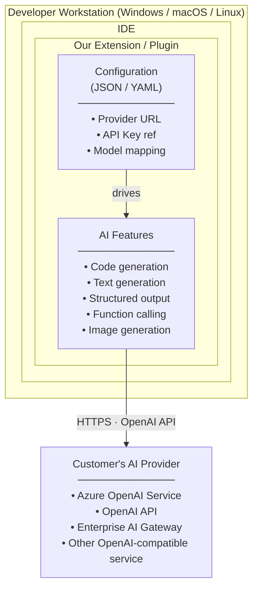
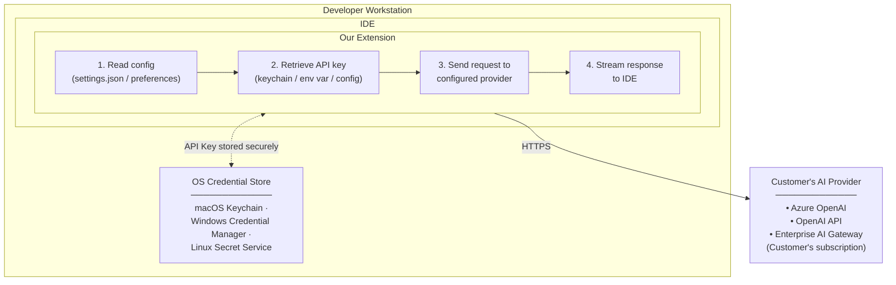

# 1. Introduction

## 1.1 Purpose

This Software Requirements Specification (SRS) describes the requirements for the **AI Client Extension**: an OpenAI-compatible AI service provisioning system for IDE environments. This document is intended for:

- **Development Teams**: To understand what needs to be implemented
- **Quality Assurance**: To create test plans and verify requirements
- **Project Management**: To plan and track development
- **Stakeholders**: To validate

 that needs are correctly captured
- **Enterprise IT**: To evaluate security, deployment, and configuration requirements
- **Solutions Engineers**: To support enterprise customer evaluations and deployments

### Context

We are an enterprise software vendor providing development tools to enterprise customers. Our products—VS Code extensions, Eclipse plugins, and other IDE integrations—are installed on **developer workstations and laptops** (Windows, macOS, Linux). We are incorporating Generative AI features into these tools and need to provide flexibility for customers to configure any OpenAI API-compliant cloud service while maintaining enterprise-grade security and administrative control.

### Strategic Rationale

A key driver for this architecture is **reducing friction in the evaluation phase of the sales cycle**. Prospective customers evaluating our AI-powered tools should not be required to stand up AI gateways, deploy proxy infrastructure, or configure enterprise middleware before they can experience the product's value. The only prerequisites should be:

1. **An API key** (BYOK — Bring Your Own Key) for any OpenAI-compatible cloud service (OpenAI, Azure OpenAI, etc.)
2. **Network access** to that service from the developer's workstation

This "zero-infrastructure" evaluation path lets prospects go from installation to first AI interaction in minutes, not weeks—removing a common deal blocker in enterprise sales cycles where IT approval for infrastructure changes can stall evaluations indefinitely.

At the same time, the architecture provides a **clear graduation path to enterprise-grade AI governance**. When a customer moves from evaluation to production deployment, they can introduce an enterprise AI gateway, SSO, centralized policy controls, and observability—all through configuration changes alone, with **zero code modifications** to the extension. This dual-track design ensures we win evaluations quickly while meeting the security and compliance bar required for enterprise procurement.

---

## 1.2 Scope

### Product Name

**AI Client Extension** — OpenAI-Compatible AI Service Provisioning for IDE Environments

### Product Description

This project establishes a standardized client-side configuration framework for accessing OpenAI API-compliant cloud services from our IDE extensions. Configuration follows IDE best practices (JSON/YAML) and supports:

- **Provider Flexibility:** Configure any OpenAI API-compatible endpoint (Azure OpenAI, OpenAI, Anthropic Claude, enterprise gateways, or self-hosted Ollama)
- **Enterprise Control:** IT administrators can deploy managed configuration profiles
- **User Customization:** Individual developers can override settings where permitted
- **Cross-Platform:** Consistent configuration across Windows, macOS, and Linux

### In Scope

The following capabilities are included in version 1.0:

| Use Case | API Endpoint / Protocol | Status |
|----------|------------------------|--------|
| **Text Generation** | `/v1/chat/completions` | ✅ In Scope |
| **Code Generation** | `/v1/chat/completions` | ✅ In Scope |
| **Structured Output** | `/v1/chat/completions` (JSON mode) | ✅ In Scope |
| **Function Calling** | `/v1/chat/completions` (tools) | ✅ In Scope |
| **Image Generation** | `/v1/images/generations` | ✅ In Scope (limited: single image generation only) |
| **Model Context Protocol (MCP)** | MCP Server via `vscode.lm` API | ✅ In Scope |
| **BYOK / SecretStorage** | VS Code `SecretStorage` API | ✅ In Scope |
| **Enterprise SSO** | `vscode.authentication` provider | ✅ In Scope |

**Note**: Image generation is limited to single image generation only. Batch generation, image editing (`/v1/images/edits`), and image variations (`/v1/images/variations`) are not supported in v1.

### Out of Scope (v1)

The following items are explicitly **not included** in the v1 release:

| Item | Rationale | Future Version |
|------|-----------|----------------|
| **Agents / Assistants API** | Complex stateful interactions requiring persistent threads, file storage, and code interpreter runtime; fundamentally different architecture from v1 stateless tool-call model | Deferred indefinitely |
| **LangGraph / Agent Frameworks** | Local or remote agent runtimes require stateful orchestration, Python runtimes, and human-in-the-loop UX patterns beyond v1 scope | v2+ |
| **Audio/Speech APIs** | `/v1/audio/*` endpoints not needed for dev tools | N/A |
| **Embeddings API** | Search/RAG use cases deferred | v1.1 |
| **AWS Bedrock Native Auth (SigV4)** | Requires AWS SDK dependency; customers can access Bedrock via enterprise gateway or OpenAI-compatible endpoint | v1.1 |
| **Central Configuration Management** | Enterprise profile distribution from control point | v1.1 |
| **Admin Console / UI** | Configuration via JSON/YAML sufficient for v1 | v1.1 |
| **Usage Analytics Dashboard** | Customers use provider's own dashboards | v2 |
| **Prompt Templates / Library** | Would require content storage | v2 |

### Customer Responsibility

The following capabilities are the responsibility of the customer and their AI provider:

| Item | Notes |
|------|-------|
| **Content Filtering** | Configured at provider level (Azure Content Safety, OpenAI moderation) |
| **Usage Monitoring** | Use provider dashboards (Azure Portal, OpenAI Usage) |
| **Rate Limiting** | Provider-side limits; customer manages quotas with their provider |

---

## 1.3 Product Perspective

### System Context

The AI Client Extension operates as a client-side component installed on developer workstations, mediating between IDE features and customer-configured AI providers:

### Key Benefits

- **Unlock Azure-first customers:** Large enterprises with existing Azure OpenAI deployments
- **Reduce support burden:** Consistent configuration patterns reduce "it doesn't work" tickets
- **Pass security reviews:** No hardcoded credentials; enterprise credential patterns supported
- **Enable IT control:** Managed configuration profiles for enterprise-wide deployment
- **Single codebase:** No per-provider code paths; configuration-driven provider selection

### Value Proposition by Stakeholder

| Stakeholder | Value Delivered |
|-------------|-----------------|
| **Enterprise IT** | Centrally manage AI provider configuration; enforce approved endpoints |
| **Developers** | AI features work out-of-the-box with their organization's approved provider |
| **Security Teams** | No hardcoded credentials; supports enterprise credential management |
| **Our Product** | Single codebase works with any OpenAI-compatible provider |
| **Our Engineering** | No per-provider code paths; configuration-driven provider selection |

### Data Flow Architecture

Our extension runs on the developer's workstation and communicates directly with the customer's configured AI provider:

### What We (the Vendor) See

| Data Type | Do We See It? | Notes |
|-----------|---------------|-------|
| Prompts / Code | ❌ No | Sent directly from workstation to customer's provider |
| Completions | ❌ No | Returned directly from provider to workstation |
| API Keys | ❌ No | Stored on customer's machine; never transmitted to us |
| Configuration | ❌ No | Local to customer's machines |
| Usage Telemetry | ⚠️ Only if opted-in | Optional, anonymized telemetry for product improvement |

---

## 1.4 Definitions, Acronyms, and Abbreviations

| Term | Definition |
|------|------------|
| **API** | Application Programming Interface |
| **BYOK** | Bring Your Own Key — user-supplied credentials |
| **EARS** | Easy Approach to Requirements Syntax |
| **IDE** | Integrated Development Environment (e.g., VS Code, Eclipse) |
| **LLM** | Large Language Model |
| **MCP** | Model Context Protocol — standard for tool/resource exposure to AI models |
| **NFR** | Non-Functional Requirement |
| **OpenAI API** | REST API specification for chat completions, originally by OpenAI, now widely adopted |
| **Provider** | An AI service endpoint (Azure OpenAI, OpenAI, enterprise gateway, Ollama, etc.) |
| **SecretStorage** | VS Code API for secure credential storage using OS-level keychains |
| **SSE** | Server-Sent Events — HTTP streaming protocol for incremental responses |
| **SSO** | Single Sign-On |
| **SRS** | Software Requirements Specification |
| **UAT** | User Acceptance Testing |
| **Universal LLM Client** | HTTP client adhering to OpenAI API wire format, provider-agnostic |

*For complete glossary with 40+ terms, see [Appendix B: Glossary](appendix-b-glossary.md).*

---

## 1.5 References

### Normative References

- **ISO/IEC/IEEE 29148:2018** — Systems and software engineering — Life cycle processes — Requirements engineering
- **OpenAI API Reference** — <https://platform.openai.com/docs/api-reference>
- **OpenAI API Concepts** — <https://platform.openai.com/docs/concepts>
- **Model Context Protocol (MCP) Specification** — <https://modelcontextprotocol.io/>
- **VS Code Extension API** — <https://code.visualstudio.com/api>
  - `SecretStorage` API — <https://code.visualstudio.com/api/references/vscode-api#SecretStorage>
  - `Authentication` API — <https://code.visualstudio.com/api/references/vscode-api#authentication>
  - MCP Integration APIs

### Informative References

- **Azure OpenAI Service Documentation** — <https://learn.microsoft.com/en-us/azure/ai-services/openai/>
- **vLLM Documentation** — <https://docs.vllm.ai/>
- **EARS (Easy Approach to Requirements Syntax)** — Mavin, A. et al. (2009)
- **MoSCoW Prioritization** — Agile requirements prioritization framework
- **RFC 2119** — Key words for use in RFCs to Indicate Requirement Levels

---

**[Back to main document](../ai-client-srs.md)** | **[Next: Overall Description →](02-overall-description.md)**
