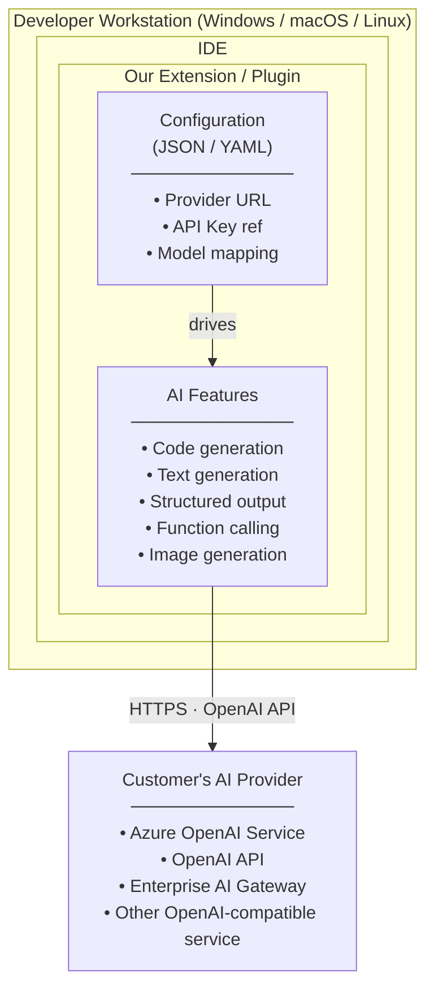

# 2. Overall Description

## 2.1 Product Functions

This project establishes a standardized client-side configuration framework for accessing OpenAI API-compliant cloud services from our IDE extensions. The extension runs on the developer's workstation and communicates directly with the customer's configured AI provider:

**Core Functions:**

- **Provider Flexibility:** Configure any OpenAI API-compatible endpoint (Azure OpenAI, OpenAI, Anthropic Claude, enterprise gateways, or self-hosted Ollama)
- **Enterprise Control:** IT administrators can deploy managed configuration profiles
- **User Customization:** Individual developers can override settings where permitted
- **Cross-Platform:** Consistent configuration across Windows, macOS, and Linux
- **Secure Credential Management:** API keys stored in OS-level secure storage via VS Code `SecretStorage` API
- **Tool Integration:** Model Context Protocol (MCP) support for agentic capabilities
- **Enterprise Graduation:** Zero-code-change transition from evaluation (BYOK) to production (enterprise gateway + SSO)

**Supported Use Cases:**

| Use Case | API Endpoint / Protocol | Status |
|----------|------------------------|--------|
| **Text Generation** | `/v1/chat/completions` | ✅ In Scope |
| **Code Generation** | `/v1/chat/completions` | ✅ In Scope |
| **Structured Output** | `/v1/chat/completions` (JSON mode) | ✅ In Scope |
| **Function Calling** | `/v1/chat/completions` (tools) | ✅ In Scope |
| **Image Generation** | `/v1/images/generations` | ✅ In Scope (limited: single image generation only; batch generation, image editing, and variations not supported in v1) |
| **Model Context Protocol (MCP)** | MCP Server via `vscode.lm` API | ✅ In Scope (v0.7) |
| **BYOK / SecretStorage** | VS Code `SecretStorage` API | ✅ In Scope (v0.7) |
| **Enterprise SSO** | `vscode.authentication` provider | ✅ In Scope (v0.7) |
| Agents / Assistants API | `/v1/assistants/*` | ❌ Out of Scope |
| Embeddings | `/v1/embeddings` | ⚠️ Future |
| Audio/Speech | `/v1/audio/*` | ❌ Out of Scope |

**Value Proposition:**

| Stakeholder | Value Delivered |
|-------------|-----------------|
| **Enterprise IT** | Centrally manage AI provider configuration; enforce approved endpoints |
| **Developers** | AI features work out-of-the-box with their organization's approved provider |
| **Security Teams** | No hardcoded credentials; supports enterprise credential management |
| **Our Product** | Single codebase works with any OpenAI-compatible provider |
| **Our Engineering** | No per-provider code paths; configuration-driven provider selection |

---

## 2.2 User Classes and Characteristics

### Customer-Side Personas

| Persona | Role | Context | Primary Need |
|---------|------|---------|--------------|
| **IT Administrator** | Manages developer tooling | Rolling out our extension to 500+ developers | "Let me define one configuration and push it to all machines" |
| **Security Engineer** | Reviews developer tools | Evaluating our extension for approval | "Show me API keys are not stored in plaintext; show me the data flow" |
| **Developer (Power User)** | Uses AI features extensively | Wants to customize model settings | "Let me use a different model for certain tasks, if IT allows" |
| **Developer (Typical)** | Uses AI features casually | Just wants it to work | "I don't want to configure anything; it should just work with our company's AI" |

### Internal Personas

| Persona | Role | Primary Need |
|---------|------|--------------|
| **Product Manager** | Owns AI feature adoption | Unblock enterprise deals with flexible provider support |
| **Extension Developer** | Builds VS Code/Eclipse plugins | Clean API to call AI services without provider-specific code |
| **Solutions Engineer** | Supports enterprise customers | Clear configuration docs; managed deployment options |
| **Technical Writer** | Creates user/admin docs | Configuration reference for all platforms and IDEs |

---

## 2.3 Operating Environment

### Deployment Context

Our product is an **IDE extension** installed on developer workstations and laptops (Windows, macOS, Linux). We are incorporating Generative AI features into these tools and need to provide flexibility for customers to configure any OpenAI API-compliant cloud service while maintaining enterprise-grade security and administrative control.

### Deployment Model

### Strategic Rationale

A key driver for this architecture is **reducing friction in the evaluation phase of the sales cycle**. Prospective customers evaluating our AI-powered tools should not be required to stand up AI gateways, deploy proxy infrastructure, or configure enterprise middleware before they can experience the product's value. The only prerequisites should be:

1. **An API key** (BYOK — Bring Your Own Key) for any OpenAI-compatible cloud service (OpenAI, Azure OpenAI, etc.)
2. **Network access** to that service from the developer's workstation

This "zero-infrastructure" evaluation path lets prospects go from installation to first AI interaction in minutes, not weeks—removing a common deal blocker in enterprise sales cycles where IT approval for infrastructure changes can stall evaluations indefinitely.

At the same time, the architecture provides a **clear graduation path to enterprise-grade AI governance**. When a customer moves from evaluation to production deployment, they can introduce an enterprise AI gateway, SSO, centralized policy controls, and observability—all through configuration changes alone, with **zero code modifications** to the extension (see §2.4 Enterprise Graduation requirements). This dual-track design ensures we win evaluations quickly while meeting the security and compliance bar required for enterprise procurement.

### Supported Platforms

| Platform | Versions | Notes |
|----------|----------|-------|
| **Windows** | 10+ | x64 and ARM64 |
| **macOS** | 11+ | Intel and Apple Silicon |
| **Linux** | Ubuntu 20.04+, RHEL 8+, Debian 11+ | x64 and ARM64 |
| **VS Code** | Latest 3 major versions | Primary IDE target |
| **Eclipse** | Latest 2 major versions | Secondary IDE target |

---

## 2.4 Design and Implementation Constraints

### Provider-Agnostic Interface (Wire Protocol)

**Requirement:** The extension must use a **Universal LLM Client** that communicates via the OpenAI Chat Completions wire format.

**Implementation Constraints:**

* **No vendor-specific SDKs** as the primary integration path. Do not depend on `@openai/openai` or `@anthropic-ai/sdk` directly. Use plain HTTP (Node.js `fetch` or equivalent) against the OpenAI-compatible REST surface.
* Target a configurable **`BASE_URL`** and **`MODEL_NAME`**.
* By default, `BASE_URL` should be editable in VS Code Settings (e.g., `https://api.openai.com/v1` for evaluation or `https://gateway.acme.com/v1` for enterprise).
* **URL Path Handling:** The `BASE_URL` must be the **complete base path** to which API-specific paths (e.g., `/chat/completions`, `/images/generations`) are appended. For Azure OpenAI, this includes the deployment: `https://<resource>.openai.azure.com/openai/deployments/<deployment-name>`. The extension appends `/chat/completions` (or other endpoint paths) to construct the full request URL.
* The extension must pass through custom headers and query parameters (e.g., Azure `api-version`) without hard-coding provider-specific logic.

### Frictionless BYOK — Secure Key Storage

**Requirement:** Enable users to supply their own API keys without requiring backend infrastructure.

**Implementation Constraints:**

* Utilize the **VS Code `SecretStorage` API** (`context.secrets`) to persist API keys locally on the user's machine. **Never** store keys in `globalState`, `workspaceState`, or standard JSON settings files.
* Support **Header Injection**: The extension must allow custom authentication headers (e.g., `X-Api-Key`, `Authorization: Bearer …`) to be dynamically populated from `SecretStorage` at request time.
* Provide a first-run "Set API Key" command that writes to `SecretStorage` and confirms success.

### Tooling & Agency (Model Context Protocol)

**Requirement:** Use the **Model Context Protocol (MCP)** as the standard for tool capabilities. **No local AI agent runtime is required.**

**Dual MCP Role:**

The extension serves two complementary MCP roles:

1. **MCP Server** — The extension registers as an MCP Server (via `vscode.lm.registerMcpServerDefinitionProvider`), exposing tools that *other* MCP hosts in the VS Code ecosystem (e.g., GitHub Copilot) can discover and invoke.
2. **Tool-Call Orchestrator** — For its *own* LLM interactions, the extension contains a lightweight orchestration loop that iteratively executes `tool_calls` returned by the cloud model via the Chat Completions API until the model produces a final text response.

Critically, the cloud-hosted model (e.g., GPT-4, Claude) acts as its own planner. The extension is a **stateless executor** — it does not run a local agent, reasoning framework, or planning engine. "Agent-like" multi-step behavior emerges from the model's native ability to emit `tool_calls` iteratively, with the extension mechanically executing and returning results.

**Implementation Constraints:**

* Register the extension as an **MCP Server** using the `vscode.lm.registerMcpServerDefinitionProvider` API.
* Expose extension-specific capabilities as **MCP Tools**, including (but not limited to):
  * `search_codebase` — workspace-wide text / symbol search
  * `run_unit_tests` — execute test suites and return results
  * `read_file_context` — read file contents with line ranges
* **MCP Tool Permission Model:** Tools exposed via MCP Server must be classified by risk level (`safe`, `read-only`, `write-only`, `destructive`). The extension must maintain an allowlist of external MCP hosts authorized to invoke each tool category. By default, only `safe` and `read-only` tools are externally visible. Destructive tools (e.g., `run_terminal_command`) are internal-only unless explicitly authorized.
* **Workspace Trust Integration:** In untrusted workspaces (per VS Code Workspace Trust API), the extension must disable tool execution, limit model interactions to read-only context (e.g., open file contents only), and suppress `run_unit_tests` and `run_terminal_command` tools entirely.
* **Reasoning vs. Execution model:** The cloud model is the brain (decides *what* to do). The extension is the hands (decides *how* to do it safely). The tool-call orchestration loop sends tool definitions to the model, executes any returned `tool_calls` locally via the VS Code Extension API, appends results as `tool` role messages, and re-calls the model — repeating until a final text response is produced or a maximum iteration limit is reached.
* **Tool Execution Path:** When the extension's own tool-call orchestrator invokes tools for its internal LLM interactions, it calls tool implementations **directly** (internal function calls), not via the MCP protocol. The MCP Server registration is solely for exposing tools to *external* MCP hosts (e.g., GitHub Copilot). This avoids protocol overhead and serialization round-trips for internal tool use.
* MCP tool definitions must include JSON Schema parameter descriptions to maximize model accuracy.
* The tool-call orchestration loop must be implemented as a **modular, replaceable component** (`ToolOrchestrator` interface) to support future substitution with more advanced orchestration backends (see Future-Proofing constraints below).

### Path to Enterprise — The Gateway Graduation

**Requirement:** The architecture must support a **zero-code-change transition** from direct SaaS access to enterprise-governed access.

**Implementation Constraints:**

* **SSO Integration:** Implement support for the `vscode.authentication` provider API. When a `BASE_URL` points to an enterprise gateway, the extension should attempt to exchange a VS Code session token for a gateway bearer token via OIDC / OAuth flow.
* **Telemetry & Observability:** Include a `X-Request-Id` header (UUID v4) in **all** outgoing LLM calls to allow enterprise IT to trace requests from the IDE through their AI Gateway and into the upstream provider.
* **Proxy awareness:** Respect VS Code's built-in proxy settings and `HTTP_PROXY` / `HTTPS_PROXY` environment variables for corporate network environments.

### Evaluation ↔ Enterprise Specification Summary

| Component | Evaluation Requirement (BYOK) | Enterprise Requirement (Production) |
| --- | --- | --- |
| **Auth** | User-pasted key in `SecretStorage` | OIDC / OAuth via `vscode.authentication` |
| **Routing** | Direct to SaaS (OpenAI, Anthropic, Azure OpenAI) | Internal AI Gateway (Kong, Cloudflare, etc.) |
| **Protocol** | OpenAI-Compatible REST + MCP for Tools | OpenAI-Compatible REST + MCP for Tools |
| **Connectivity** | Public Internet (Node.js `fetch`) | Corporate VPN / Proxy aware |
| **Telemetry** | Optional opt-in | `X-Request-Id` tracing through gateway |
| **Key Storage** | VS Code `SecretStorage` | `SecretStorage` + SSO token exchange |

### Future-Proofing: Architectural Hedges for Agent Frameworks

> **Context:** While local/remote agent frameworks (e.g., LangGraph, CrewAI) are explicitly **out of scope** for v1, the following low-cost architectural hedges ensure the extension can adopt advanced orchestration in the future with minimal refactoring. These are *design constraints*, not features — they impose structure on v1 implementation to preserve optionality.

**1. Modular Tool Orchestrator**

* The tool-call loop (send tools → receive `tool_calls` → execute → return results → repeat) must be encapsulated behind a **`ToolOrchestrator` interface**. The v1 implementation is a simple iterative loop driven by Chat Completions `tool_calls`. In a future version, this interface could be swapped for a LangGraph-backed orchestrator or cloud-hosted agent endpoint — with no changes to the rest of the extension.

**2. Conversation Thread IDs**

* Every conversation or multi-turn interaction must be assigned a **`thread_id`** (UUID v4), even though v1 does not persist conversation state. This in-memory correlation ID maps directly to LangGraph's thread concept and enables future checkpointing, resume, and replay without retroactively adding identifiers.

**3. Event-Typed Streaming**

* The internal streaming layer must emit **typed events** rather than raw token strings. The v1 event types are: `token`, `tool_call`, `tool_result`, `status`, and `error`. Even though v1 consumers primarily use `token` events, this structure allows future agent orchestrators to emit additional event types (e.g., `plan_step`, `human_approval_needed`, `state_transition`) without breaking the streaming contract.

**4. Multi-Step UX Readiness**

* The UI layer must not assume that a single user action produces a single model response. The tool-call loop already breaks this assumption, but the UX components (progress indicators, output panels) must be designed to display **step-by-step progress** for multi-turn interactions. This ensures future agent workflows — which may involve planning, branching, and human-in-the-loop approvals — can surface their state in the existing UI framework.

---

## 2.5 Assumptions and Dependencies

### Assumptions

| ID | Assumption | Risk if Invalid |
|----|------------|-----------------|
| A-01 | Customers have access to an OpenAI API-compatible service (Azure OpenAI, OpenAI, or enterprise gateway) | Must provide guidance on provider setup |
| A-02 | Developer workstations can reach the AI provider endpoint (directly or via corporate proxy) | Must support proxy configuration |
| A-03 | Target providers implement OpenAI API v1 specification | Azure OpenAI ✅, OpenAI ✅, most enterprise gateways ✅ |
| A-04 | IT administrators have mechanisms to deploy configuration to developer machines (GPO, MDM, config management) | Central config management is optional enhancement |
| A-05 | VS Code and Eclipse support our extension's settings schema | Standard extension settings mechanisms exist |

### Dependencies (Internal Engineering)

| Dependency | Owner | Status | Risk if Delayed |
|------------|-------|--------|-----------------|
| Configuration schema design | Extension Team | 🟡 In Progress | Cannot finalize settings documentation |
| VS Code settings integration | VS Code Team | 🟢 Complete | Basic extension settings work |
| Eclipse preferences integration | Eclipse Team | 🟡 In Progress | Eclipse users cannot configure AI |
| Credential storage via SecretStorage | Platform Team | 🟢 Complete (v0.7) | Credentials stored in OS-level secure storage via VS Code API |
| HTTP client with proxy support | Platform Team | 🟢 Complete | Corporate proxy environments blocked |
| Central config profile system | Platform Team | 🔴 Not Started (v1.1) | No managed configuration option |

### Customer-Side Prerequisites

| Prerequisite | Customer Responsibility | We Provide |
|--------------|------------------------|------------|
| AI Provider Access | Provision Azure OpenAI or obtain OpenAI API access | Configuration examples per provider |
| API Credentials | Obtain API key from their provider | Secure storage guidance |
| Network Access | Ensure workstations can reach provider endpoint | Proxy configuration documentation |
| (Optional) Config Distribution | Deploy settings to developer machines | Settings schema documentation |

---

[← Previous](01-introduction.md) | [Back to main](../ai-client-srs.md) | [Next →](03-system-features.md)
