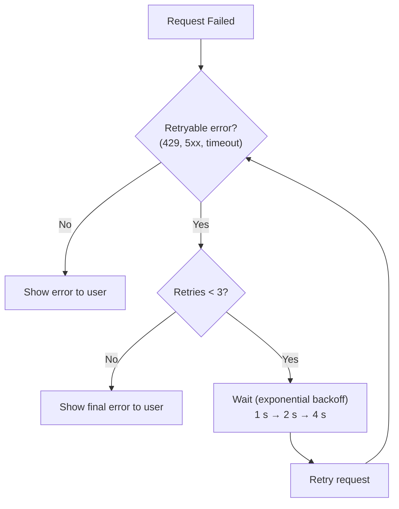

# 3. System Features (Functional Requirements)

## EARS Syntax Legend

All requirements use the **Easy Approach to Requirements Syntax (EARS)** for clarity and testability:

| Pattern | Example | When to Use |
|---------|---------|-------------|
| **Ubiquitous** | "The extension **shall**..." | Always applies |
| **Event-driven** | "**When** X occurs, the extension **shall**..." | Triggered by event |
| **State-driven** | "**While** in state X, the extension **shall**..." | Applies during state |
| **Optional feature** | "**Where** feature X is enabled, the extension **shall**..." | Conditional on configuration |
| **Unwanted behavior** | "**If** X occurs, the extension **shall**..." | Error handling |

**Priority Legend (MoSCoW):**
- **Must:** Critical for launch; extension is not viable without it
- **Should:** Important but not critical; can launch without if necessary  
- **Could:** Desirable; implement if time permits
- **Won't (v1):** Explicitly excluded from this version

---

## Requirement ID Migration Table

This table maps original requirement IDs to new domain-prefixed IDs:

| Old ID | New ID | Domain | Old ID | New ID | Domain |
|--------|--------|--------|--------|--------|--------|
| REQ-01 | REQ-CFG-001 | Configuration | REQ-52 | REQ-CRED-008 | Credential |
| REQ-02 | REQ-CFG-002 | Configuration | REQ-52a | REQ-CRED-009 | Credential |
| REQ-03 | REQ-CFG-003 | Configuration | REQ-53 | REQ-CRED-010 | Credential |
| REQ-04 | REQ-CFG-004 | Configuration | REQ-54 | REQ-CRED-011 | Credential |
| REQ-05 | REQ-CFG-005 | Configuration | REQ-12 | REQ-API-001 | API |
| REQ-06 | REQ-CFG-006 | Configuration | REQ-13 | REQ-API-002 | API |
| REQ-07 | REQ-CRED-001 | Credential | REQ-14 | REQ-API-003 | API |
| REQ-07a | REQ-CRED-002 | Credential | REQ-15 | REQ-API-004 | API |
| REQ-08 | REQ-CRED-003 | Credential | REQ-16 | REQ-API-005 | API |
| REQ-09 | REQ-CRED-004 | Credential | REQ-17 | REQ-API-006 | API |
| REQ-10 | REQ-CRED-005 | Credential | REQ-93 | REQ-API-007 | API |
| REQ-11 | REQ-CRED-006 | Credential | REQ-94 | REQ-API-008 | API |
| REQ-55 | REQ-CRED-007 | Credential | REQ-79 | REQ-PROV-001 | Provider |
| REQ-80 | REQ-PROV-002 | Provider | REQ-72 | REQ-TOOL-005 | Tool |
| REQ-81 | REQ-PROV-003 | Provider | REQ-73 | REQ-TOOL-006 | Tool |
| REQ-82 | REQ-PROV-004 | Provider | REQ-74 | REQ-TOOL-007 | Tool |
| REQ-83 | REQ-PROV-005 | Provider | REQ-75 | REQ-TOOL-008 | Tool |
| REQ-68 | REQ-PROV-006 | Provider | REQ-77 | REQ-TOOL-009 | Tool |
| REQ-69 | REQ-PROV-007 | Provider | REQ-56 | REQ-MCP-001 | MCP |
| REQ-70 | REQ-PROV-008 | Provider | REQ-57 | REQ-MCP-002 | MCP |
| REQ-71 | REQ-PROV-009 | Provider | REQ-58 | REQ-MCP-003 | MCP |
| REQ-84 | REQ-PROV-010 | Provider | REQ-59 | REQ-MCP-004 | MCP |
| REQ-85 | REQ-PROV-011 | Provider | REQ-59a | REQ-MCP-005 | MCP |
| REQ-18 | REQ-UX-001 | UX | REQ-59b | REQ-MCP-006 | MCP |
| REQ-19 | REQ-UX-002 | UX | REQ-22 | REQ-ENT-001 | Enterprise |
| REQ-20 | REQ-UX-003 | UX | REQ-23 | REQ-ENT-002 | Enterprise |
| REQ-21 | REQ-UX-004 | UX | REQ-60 | REQ-ENT-003 | Enterprise |
| REQ-21a | REQ-UX-005 | UX | REQ-61 | REQ-ENT-004 | Enterprise |
| REQ-76 | REQ-UX-006 | UX | REQ-62 | REQ-ENT-005 | Enterprise |
| REQ-76a | REQ-UX-007 | UX | REQ-63 | REQ-ENT-006 | Enterprise |
| REQ-76b | REQ-UX-008 | UX | REQ-89 | REQ-LIFE-001 | Lifecycle |
| REQ-77 → REQ-TOOL-009 | | | REQ-90 | REQ-LIFE-002 | Lifecycle |
| REQ-78 | REQ-UX-009 | UX | REQ-99 | REQ-LIFE-003 | Lifecycle |
| REQ-28 | REQ-PROMPT-001 | Prompt | | | |
| REQ-29 | REQ-PROMPT-002 | Prompt | | | |
| REQ-30 | REQ-PROMPT-003 | Prompt | | | |
| REQ-31 | REQ-PROMPT-004 | Prompt | | | |
| REQ-32 | REQ-PROMPT-005 | Prompt | | | |
| REQ-86 | REQ-PROMPT-006 | Prompt | | | |
| REQ-87 | REQ-PROMPT-007 | Prompt | | | |
| REQ-88 | REQ-PROMPT-008 | Prompt | | | |
| REQ-33 | REQ-JSON-001 | JSON | | | |
| REQ-34 | REQ-JSON-002 | JSON | | | |
| REQ-35 | REQ-JSON-003 | JSON | | | |
| REQ-36 | REQ-JSON-004 | JSON | | | |
| REQ-37 | REQ-TOOL-001 | Tool | | | |
| REQ-38 | REQ-TOOL-002 | Tool | | | |
| REQ-39 | REQ-TOOL-003 | Tool | | | |
| REQ-40 | REQ-TOOL-004 | Tool | | | |
| REQ-41 | REQ-TOOL-010 | Tool | (Req-41 maps to 010) | | |

---

## 3.1 Configuration Management

| ID | Priority | Requirement (EARS Format) |
|----|----------|---------------------------|
| **REQ-CFG-001** | Must | **The extension shall** read configuration from IDE-native settings (VS Code `settings.json`, Eclipse preferences). |
| **REQ-CFG-002** | Must | **The extension shall** support configuration in both JSON and YAML formats where the IDE permits. |
| **REQ-CFG-003** | Must | **The extension shall** allow configuration of `base_url` to any OpenAI API-compatible endpoint. |
| **REQ-CFG-004** | Must | **The extension shall** support model ID aliasing, mapping user-friendly names to provider model identifiers. |
| **REQ-CFG-005** | Must | **The extension shall** support configuration of custom headers (e.g., `api-version` for Azure OpenAI). |
| **REQ-CFG-006** | Should | **When** both user and workspace settings exist, **the extension shall** merge them with **workspace settings taking precedence** per VS Code convention (user settings as fallback). |

---

## 3.2 Credential Management (BYOK)

| ID | Priority | Requirement (EARS Format) |
|----|----------|---------------------------|
| **REQ-CRED-001** | Must | **The extension shall** use VS Code `SecretStorage` API as the primary credential storage mechanism; **when** SecretStorage is unavailable (e.g., headless/container environments), **the extension shall** fall back to OS credential stores (macOS Keychain, Windows Credential Manager, Linux Secret Service) with a warning to the user about reduced security. |
| **REQ-CRED-002** | Must | **When** both SecretStorage and OS credential stores are unavailable, **the extension shall** disable AI features requiring authentication and display a persistent warning: "Credential storage unavailable. AI features disabled. Use environment variables (OPENAI_API_KEY) as workaround." |
| **REQ-CRED-003** | Must | **The extension shall** support retrieving API keys from environment variables. |
| **REQ-CRED-004** | Should | **The extension shall** support API key entry via IDE-native secret input (masked input fields). |
| **REQ-CRED-005** | Must | **The extension shall not** store API keys in plaintext in settings files by default. |
| **REQ-CRED-006** | Must | **The extension shall** never include API keys in logs, error reports, or telemetry. |
| **REQ-CRED-007** | Should | **The extension shall** provide a first-run "Set API Key" command that writes the key to `SecretStorage` and confirms success to the user. |
| **REQ-CRED-008** | Must | **The extension shall** use the VS Code `SecretStorage` API (`context.secrets`) to persist API keys locally on the user's machine. |
| **REQ-CRED-009** | Must | **The extension shall** provide a "Delete API Key" command that removes the stored credential from `SecretStorage` and confirms the deletion to the user. |
| **REQ-CRED-010** | Must | **The extension shall not** store API keys in `globalState`, `workspaceState`, or standard JSON settings files. |
| **REQ-CRED-011** | Must | **The extension shall** support dynamic Header Injection, populating authentication headers (e.g., `Authorization`, `X-Api-Key`) from `SecretStorage` at request time. |

---

## 3.3 API Integration

| ID | Priority | Requirement (EARS Format) |
|----|----------|---------------------------|
| **REQ-API-001** | Must | **The extension shall** implement the OpenAI Chat Completions API (`/v1/chat/completions`). |
| **REQ-API-002** | Must | **The extension shall** support streaming responses via Server-Sent Events (SSE). |
| **REQ-API-003** | Must | **When** a request includes `tools` or `functions` parameters, **the extension shall** pass them unmodified to the provider. |
| **REQ-API-004** | Must | **When** `response_format: { "type": "json_object" }` is specified, **the extension shall** include it in the request. |
| **REQ-API-005** | Should | **The extension shall** support the Images API (`/v1/images/generations`) for image generation features. |
| **REQ-API-006** | Must | **The extension shall** support HTTP/HTTPS proxy configuration via IDE proxy settings and/or environment variables. |
| **REQ-API-007** | Must | **The extension shall** enforce network timeouts: 10 seconds for connection establishment, 60 seconds for streaming reads, 30 seconds for non-streaming reads. |
| **REQ-API-008** | Must | **When** a provider response exceeds 1MB, **the extension shall** truncate the response and display a warning: "Response truncated at 1MB. Consider using streaming or reducing request scope." |

---

## 3.4 Provider Management

| ID | Priority | Requirement (EARS Format) |
|----|----------|---------------------------|
| **REQ-PROV-001** | Must | **The extension shall** support multiple concurrent chat sessions without blocking or interference. |
| **REQ-PROV-002** | Should | **When** multiple requests are initiated simultaneously, **the extension shall** queue them and enforce per-provider rate limits to prevent throttling errors. |
| **REQ-PROV-003** | Should | **The extension shall** detect provider support for vision/multimodal inputs via `/v1/models` endpoint or provider-specific capability metadata. |
| **REQ-PROV-004** | Should | **When** a provider does not support a requested feature (e.g., tool calling, vision), **the extension shall** gracefully degrade by disabling the feature and notifying the user. |
| **REQ-PROV-005** | Should | **The extension shall** cache provider capability information for the duration of the session to minimize redundant API calls. |
| **REQ-PROV-006** | Must | **The extension shall** treat the configured `baseUrl` as the complete base path to which API-specific paths (e.g., `/chat/completions`) are appended. For Azure OpenAI, users must include the full deployment path in `baseUrl`. |
| **REQ-PROV-007** | Must | **The extension shall** apply provider-specific behaviors (auth header name, default headers) based on the configured `type` field as specified in the Provider Type Behaviors table. |
| **REQ-PROV-008** | Must | **The extension shall** allow users to override the default auth header name via the `authHeaderName` configuration field. |
| **REQ-PROV-009** | Must | **The extension shall** support three authentication modes via the `authMode` field: `"byok"` (SecretStorage), `"sso"` (vscode.authentication), and `"none"` (no authentication). |
| **REQ-PROV-010** | Should | **The extension shall** support configuration of multiple named provider profiles (e.g., "dev-azure", "prod-openai") in user or workspace settings. |
| **REQ-PROV-011** | Should | **The extension shall** provide a UI command or quick pick to switch the active provider profile at runtime. |

---

## 3.5 User Experience

| ID | Priority | Requirement (EARS Format) |
|----|----------|---------------------------|
| **REQ-UX-001** | Should | **When** configuration is incomplete, **the extension shall** prompt the user with guided setup. |
| **REQ-UX-002** | Should | **The extension shall** provide a "Test Connection" command to validate provider connectivity. |
| **REQ-UX-003** | Must | **When** an API error occurs, **the extension shall** display a user-friendly error message with troubleshooting guidance. |
| **REQ-UX-004** | Must | **The extension shall** indicate streaming progress during AI response generation. |
| **REQ-UX-005** | Should | **When** a user is waiting for an AI response, **the extension shall** display a progress indicator showing elapsed time and estimated completion if streaming has not yet started. |
| **REQ-UX-006** | Must | **The extension shall** support user-initiated cancellation of in-progress streaming requests via standard UI affordances (e.g., Escape key, Stop button). |
| **REQ-UX-007** | Should | **When** a streaming request is cancelled, **the extension shall** abort the HTTP request, clear partial UI state, and display a confirmation message (e.g., "Request cancelled"). |
| **REQ-UX-008** | Should | **When** a request is in progress, **the extension shall** display a cancellable progress indicator with elapsed time. |
| **REQ-UX-009** | Must | **The extension shall** sanitize provider error messages before displaying to users or writing to logs, removing internal URLs, resource identifiers, and any string matching common API key patterns. |
| **REQ-UX-010** | Must | **The extension shall** support keyboard-only operation: all AI commands accessible via Command Palette (VS Code) or menu shortcuts, no mouse-only features. |

---

## 3.6 Prompt Construction & Context

| ID | Priority | Requirement (EARS Format) |
|----|----------|---------------------------|
| **REQ-PROMPT-001** | Must | **The extension SDK shall** support all OpenAI message roles: `system`, `user`, `assistant`, and `tool`. |
| **REQ-PROMPT-002** | Must | **The extension SDK shall** provide a programmatic API for constructing message arrays without requiring user interaction. |
| **REQ-PROMPT-003** | Should | **The extension SDK shall** support prompt templates with variable substitution for reusable, parameterized prompts. |
| **REQ-PROMPT-004** | Should | **When** constructing prompts, **the extension SDK shall** provide utilities to estimate token counts before sending requests. |
| **REQ-PROMPT-005** | Should | **The extension SDK shall** support context prioritization, allowing developers to specify which context to retain when truncating for token limits. |
| **REQ-PROMPT-006** | Should | **When** the constructed prompt exceeds 90% of the model's known context window, **the extension shall** warn the user before sending the request. |
| **REQ-PROMPT-007** | Should | **When** a provider returns a token limit error (e.g., HTTP 400 with `context_length_exceeded`), **the extension shall** automatically truncate the oldest non-system messages and retry once. |
| **REQ-PROMPT-008** | Should | **When** automatic truncation occurs, **the extension shall** notify the user that context was reduced and log which messages were removed. |

---

## 3.7 Structured Output

| ID | Priority | Requirement (EARS Format) |
|----|----------|---------------------------|
| **REQ-JSON-001** | Must | **The extension SDK shall** support the `response_format: { type: "json_object" }` parameter for JSON mode. |
| **REQ-JSON-002** | Must | **When** JSON mode is requested, **the extension SDK shall** validate that the system prompt instructs the model to produce JSON. |
| **REQ-JSON-003** | Should | **The extension SDK shall** provide typed response parsing with runtime validation against a provided schema. |
| **REQ-JSON-004** | Should | **When** JSON parsing fails, **the extension SDK shall** provide a clear error indicating the parsing failure and include the raw response for debugging. |

---

## 3.8 Function Calling (Tools)

| ID | Priority | Requirement (EARS Format) |
|----|----------|---------------------------|
| **REQ-TOOL-001** | Must | **The extension SDK shall** support defining tools/functions with JSON Schema parameter definitions. |
| **REQ-TOOL-002** | Must | **The extension SDK shall** support all `tool_choice` options: `auto`, `required`, `none`, and specific function selection. |
| **REQ-TOOL-003** | Must | **When** the model returns `tool_calls`, **the extension SDK shall** provide the parsed function name and arguments. |
| **REQ-TOOL-004** | Must | **The extension SDK shall** support sending tool results back to the model via the `tool` role message. |
| **REQ-TOOL-005** | Must | **The extension's** tool-call orchestration loop **shall** terminate after a configurable maximum number of iterations (default: 25) to prevent infinite loops. |
| **REQ-TOOL-006** | Must | **The extension shall** enforce a configurable timeout (default: 30 seconds) for individual tool executions to prevent indefinite hangs. |
| **REQ-TOOL-007** | Must | **When** a tool is classified as destructive (e.g., `run_terminal_command`), **the extension shall** require explicit user approval before execution if `requireApprovalForDestructiveTools` is enabled. |
| **REQ-TOOL-008** | Must | **The extension's** internal tool-call orchestrator **shall** invoke tools via direct function calls (not via the MCP protocol) to avoid serialization overhead for its own LLM interactions. |
| **REQ-TOOL-009** | Must | **When** a tool execution returns a result exceeding 10,000 characters, **the extension shall** truncate the result and append a notice (e.g., "[Output truncated; <N> chars omitted]") before sending it to the model. |
| **REQ-TOOL-010** | Should | **The extension SDK shall** provide a tool execution loop helper that handles multi-turn tool calling until completion. |

---

## 3.9 Model Context Protocol (MCP)

| ID | Priority | Requirement (EARS Format) |
|----|----------|---------------------------|
| **REQ-MCP-001** | Must | **The extension shall** register as an MCP Server using the `vscode.lm.registerMcpServerDefinitionProvider` API. |
| **REQ-MCP-002** | Must | **The extension shall** expose extension-specific capabilities (e.g., `search_codebase`, `run_unit_tests`, `read_file_context`) as MCP Tools with JSON Schema parameter definitions. |
| **REQ-MCP-003** | Must | **The extension shall** act as the execution layer ("the hands"), receiving tool-call requests from the cloud-hosted model and executing them via the VS Code Extension API. |
| **REQ-MCP-004** | Must | **The extension shall** validate and sandbox MCP tool executions to prevent unintended side effects on the user's workspace. |
| **REQ-MCP-005** | Must | **The extension shall** classify MCP tools by risk level (`safe`, `read-only`, `write-only`, `destructive`) and maintain an allowlist of external MCP hosts authorized to invoke each tool category. |
| **REQ-MCP-006** | Must | **When** the workspace is untrusted (per VS Code Workspace Trust API), **the extension shall** disable all tool execution except read-only context retrieval from open files. |

---

## 3.10 Enterprise Graduation

| ID | Priority | Requirement (EARS Format) |
|----|----------|---------------------------|
| **REQ-ENT-001** | Won't (v1) | **The extension shall** support loading configuration profiles from a central management endpoint. |
| **REQ-ENT-002** | Won't (v1) | **When** managed configuration is deployed, **the extension shall** allow IT to lock certain settings from user override. |
| **REQ-ENT-003** | Must | **When** `BASE_URL` points to an enterprise gateway, **the extension shall** support SSO via the `vscode.authentication` provider, exchanging a VS Code session token for a gateway bearer token. |
| **REQ-ENT-004** | Must | **The extension shall** include an `X-Request-Id` header (UUID v4) in all outgoing LLM calls to enable end-to-end request tracing. |
| **REQ-ENT-005** | Must | **The extension shall** support a zero-code-change transition from direct SaaS access (BYOK) to enterprise-governed access (AI Gateway + SSO). |
| **REQ-ENT-006** | Must | **The extension shall** respect VS Code's built-in proxy settings and `HTTP_PROXY` / `HTTPS_PROXY` environment variables for corporate network environments. |

---

## 3.11 Extension Lifecycle

| ID | Priority | Requirement (EARS Format) |
|----|----------|---------------------------|
| **REQ-LIFE-001** | Must | **When** the extension is deactivated or reloaded, **the extension shall** abort in-progress requests, close open HTTP connections, and dispose of event listeners to prevent memory leaks. |
| **REQ-LIFE-002** | Should | **The extension shall** implement graceful degradation during IDE shutdown: streaming requests shall be cancelled with a timeout of 5 seconds before forceful termination. |
| **REQ-LIFE-003** | Must | **The extension shall** activate on the following events: (1) `onStartupFinished` for background MCP Server registration, (2) `onCommand:ourProduct.ai.*` for user-invoked AI commands, (3) `onView:ourProductAiChat` if a dedicated AI view is contributed. The extension shall complete activation within 2 seconds (per NFR). |

---

## Security & Privacy Requirements

*Note: Security requirements have been reclassified into domain-specific non-functional requirements. See [Non-Functional Requirements](05-nonfunctional-requirements.md) §5.3 Security Requirements.*

**Prompt Injection Mitigation:**

| ID | Priority | Requirement (EARS Format) |
|----|----------|---------------------------|
| **REQ-SEC-001** | Must | **When** constructing prompts with user-provided content, **the extension SDK shall** clearly delimit user content to reduce prompt injection risk. |

---

## Future-Proofing (Architectural Hedges)

*These requirements support future agent framework integration without requiring v1 feature implementations:*

| ID | Priority | Requirement (EARS Format) |
|----|----------|---------------------------|
| **REQ-ARCH-001** | Must | **The extension shall** encapsulate tool-call orchestration behind a `ToolOrchestrator` interface, allowing the iterative tool-call loop to be replaced with an alternative orchestration backend without modifying other extension components. |
| **REQ-ARCH-002** | Must | **The extension shall** assign a `thread_id` (UUID v4) to every conversation or multi-turn interaction, available in-memory for the duration of the interaction. |
| **REQ-ARCH-003** | Must | **The extension's** internal streaming layer **shall** emit typed events (minimally: `token`, `tool_call`, `tool_result`, `status`, `error`) rather than raw token strings, to support future event types without breaking the streaming contract. |
| **REQ-ARCH-004** | Should | **The extension's** UI components for AI interactions **shall** support displaying step-by-step progress for multi-turn tool-call sequences, not assuming a single model response per user action. |

---

## Error Handling Context

### Provider Error Responses

| Provider Error | Extension Behavior | User Feedback |
|----------------|-------------------|---------------|
| **401 Unauthorized** | No retry | "Authentication failed. Check your API key." + link to settings |
| **403 Forbidden** | No retry | "Access denied. Your API key may lack required permissions." |
| **429 Rate Limited** | Retry with backoff (respects `Retry-After`) | "Rate limited. Retrying..." or "Rate limit exceeded. Try again later." |
| **400 Bad Request** | No retry | "Request error: {sanitized provider message}" (see REQ-UX-009 for sanitization rules) |
| **500 Internal Error** | Retry up to 3x with exponential backoff | "Provider error. Retrying..." or "Provider unavailable." |
| **502/503 Unavailable** | Retry up to 3x | "Provider temporarily unavailable. Retrying..." |
| **Timeout** | Retry once | "Request timed out. Retrying..." or "Request timed out. Check network." |
| **Network Error** | Check connectivity | "Cannot reach AI provider. Check your network connection." |

### Retry Strategy

---

[← Previous](02-overall-description.md) | [Back to main](../ai-client-srs.md) | [Next →](04-external-interfaces.md)
