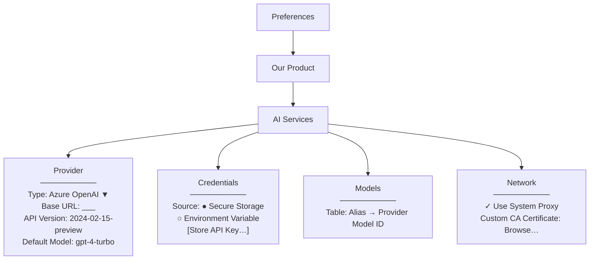
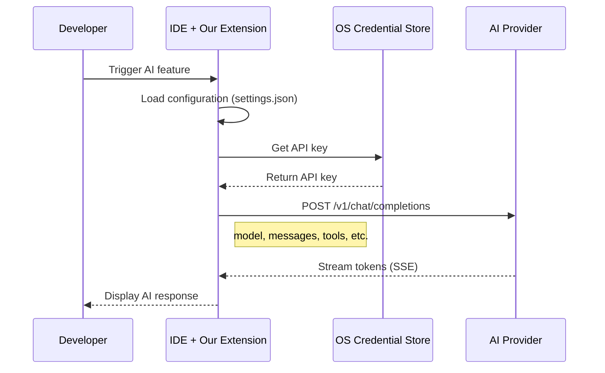
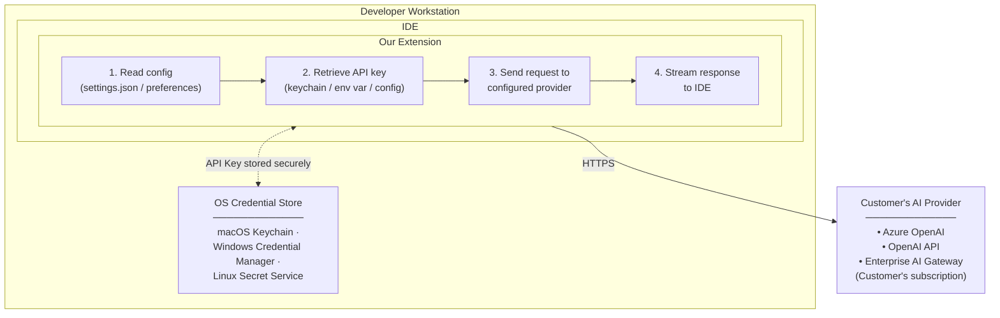

# 4. External Interface Requirements

## 4.1 User Interfaces

### VS Code Settings (`settings.json`)

Configuration uses VS Code's native settings system. Our extension contributes settings under a namespace (e.g., `ourProduct.ai`). This approach aligns with VS Code best practices and allows familiar configuration patterns.

**Example: User or Workspace `settings.json`**

```jsonc
{
  // AI Provider Configuration
  "ourProduct.ai.provider": {
    // Provider endpoint (required)
    "baseUrl": "https://mycompany.openai.azure.com/openai/deployments/gpt-4",
    
    // Provider type for provider-specific behaviors (see Provider Type Behaviors table below)
    "type": "azure-openai",  // "azure-openai" | "openai" | "anthropic" | "ollama" | "openshift-ai" | "bedrock" | "compatible"
    
    // Authentication mode: "byok" (Bring Your Own Key via SecretStorage), "sso" (Enterprise SSO via vscode.authentication), or "none" (no auth)
    "authMode": "byok",  // "byok" | "sso" | "none"
    
    // Override auth header name (optional; defaults per provider type in Provider Type Behaviors table)
    "authHeaderName": "Authorization",  // e.g., "Authorization", "X-Api-Key", "api-key"
    
    // Additional headers (e.g., Azure API version)
    "headers": {
      "api-version": "2024-02-15-preview"
    },
    
    // Default model (can be overridden per feature)
    "defaultModel": "gpt-4-turbo"
  },
  
  // Model aliases - map friendly names to provider model IDs
  "ourProduct.ai.models": {
    "default": "gpt-4-turbo",
    "fast": "gpt-35-turbo",
    "reasoning": "gpt-4-turbo"
  },
  
  // Credential source (API key retrieved separately for security)
  "ourProduct.ai.credentials": {
    // Where to get the API key
    "source": "keychain",  // "keychain" | "environment" | "prompt"
    
    // Environment variable name (if source is "environment")
    "environmentVariable": "OPENAI_API_KEY",
    
    // Keychain/Credential Manager entry name (if source is "keychain")
    "keychainEntry": "ourProduct-ai-apikey"
  },
  
  // Feature-specific settings
  "ourProduct.ai.codeCompletion": {
    "enabled": true,
    "model": "fast",  // Uses model alias
    "maxTokens": 500
  },
  
  "ourProduct.ai.chat": {
    "enabled": true,
    "model": "default",
    "maxTokens": 4096,
    "temperature": 0.7
  },
  
  // Tool execution safety limits
  "ourProduct.ai.tooling": {
    // Maximum iterations for tool-call orchestration loop (circuit breaker)
    "maxLoopIterations": 25,
    
    // Tool execution timeout in seconds
    "toolTimeout": 30,
    
    // Require user approval for destructive tools (run_terminal_command, etc.)
    "requireApprovalForDestructiveTools": true
  },
  
  // Network settings
  "ourProduct.ai.network": {
    // Use VS Code's proxy settings, or override here
    "useSystemProxy": true,
    
    // Custom CA certificate for enterprise PKI
    "caCertificatePath": "/path/to/corporate-ca.crt",
    
    // Request timeout in seconds
    "timeout": 60
  },
  
  // Privacy settings
  "ourProduct.ai.telemetry": {
    "enabled": false  // Opt-in only
  }
}
```

### Eclipse Preferences

Eclipse uses its preference system. Configuration is stored in workspace or user preferences. The extension shall provide a preference page under the product namespace accessible via **Window > Preferences > [Product Name] > AI Services**.

**Implementation Requirements:**
- Preference page shall use Eclipse JFace preference framework with `FieldEditorPreferencePage`
- Provider type shall be implemented as `ComboFieldEditor` with enum validation
- API keys shall use `StringFieldEditor` with `echo` char set to `'*'` for masking
- Base URL shall use `StringFieldEditor` with URL validation
- Credentials shall be stored in Eclipse Secure Storage (`ISecurePreferences` API) under node `com.ourproduct.ai/credentials`
- Preference changes shall trigger `IPropertyChangeListener` notifications to refresh active connections

**Example: Preference Page Structure**



### Configuration Examples by Provider

#### Azure OpenAI

```jsonc
{
  "ourProduct.ai.provider": {
    "type": "azure-openai",
    "baseUrl": "https://{resource-name}.openai.azure.com/openai/deployments/{deployment-name}",
    "authMode": "byok",
    "headers": {
      "api-version": "2024-02-15-preview"
    }
  }
}
```

**Note:** The extension appends `/chat/completions` to the `baseUrl`, so the full request URL becomes:
```
https://{resource-name}.openai.azure.com/openai/deployments/{deployment-name}/chat/completions?api-version=2024-02-15-preview
```

#### OpenAI (Direct)

```jsonc
{
  "ourProduct.ai.provider": {
    "type": "openai",
    "baseUrl": "https://api.openai.com/v1",
    "defaultModel": "gpt-4-turbo"
  }
}
```

#### Enterprise Gateway

```jsonc
{
  "ourProduct.ai.provider": {
    "type": "compatible",
    "baseUrl": "https://ai-gateway.internal.mycompany.com/v1",
    "authMode": "sso",  // Use enterprise SSO instead of BYOK
    "headers": {
      "X-Department": "engineering",
      "X-Project-ID": "project-123"
    }
  }
}
```

#### Ollama (Self-Hosted)

```jsonc
{
  "ourProduct.ai.provider": {
    "type": "ollama",
    "baseUrl": "http://localhost:11434/v1",
    "defaultModel": "llama3"
  }
}
```

**Note:** For remote Ollama instances, use the appropriate hostname/IP (e.g., `http://ollama-server.internal:11434/v1`). No API key required for local instances; authentication can be configured if Ollama is secured.

### Credential Storage Options

| Method | Platform | How It Works |
|--------|----------|--------------|
| **macOS Keychain** | macOS | Stored in system Keychain; accessed via native APIs |
| **Windows Credential Manager** | Windows | Stored in Windows Credential Manager |
| **Linux Secret Service** | Linux | Stored via libsecret (GNOME Keyring, KWallet) |
| **Environment Variable** | All | Read from specified env var at runtime |
| **Interactive Prompt** | All | User prompted on first use; stored in credential store |

### Configuration Validation

The extension validates configuration and provides helpful feedback:

| Issue | User Feedback |
|-------|---------------|
| Missing `baseUrl` | "AI provider not configured. Open Settings to configure." |
| Invalid URL format | "Invalid provider URL. Expected format: https://..." |
| Missing API key | "API key not found. Run 'Configure AI API Key' command." |
| Connection failed | "Cannot connect to AI provider. Check URL and network settings." |
| Authentication failed | "API key rejected by provider. Verify your API key is correct." |

---

## 4.2 Hardware Interfaces

**Not applicable.** The extension runs within the IDE process and does not directly interface with hardware. All hardware interaction (network, storage) is mediated through IDE APIs and the operating system.

---

## 4.3 Software Interfaces

### Supported Providers

| Provider | Compatibility | Configuration Notes |
|----------|---------------|---------------------|
| **Azure OpenAI** | ✅ Native | Set `base_url` to deployment; add `api-version` header |
| **OpenAI** | ✅ Native | Default; just provide API key |
| **Enterprise Gateways** | ✅ Native | Point `base_url` to gateway; gateway handles upstream |
| **Ollama** | ✅ Native | Self-hosted; point `base_url` to local instance (e.g., `http://localhost:11434/v1`) |
| **Anthropic Claude** | ✅ Via OpenAI-compatible endpoint | Set `base_url` to `https://api.anthropic.com/v1/`; BYOK with Anthropic API key. Uses Anthropic's OpenAI-compatible surface — no adapter or translation layer needed. |
| **Red Hat OpenShift AI** | ✅ Via OpenAI-compatible endpoint | Set `base_url` to the OpenShift AI model serving route (e.g., `https://<model-route>.apps.<cluster>/v1`). Uses KServe / vLLM runtime which exposes an OpenAI-compatible inference API. BYOK with the serving endpoint's bearer token. |
| **AWS Bedrock** | ⚠️ Conditional | Supported when accessed through Bedrock's OpenAI-compatible endpoint or an enterprise AI gateway that exposes an OpenAI-compatible surface. Native Bedrock SigV4 auth is **not** supported in v1; customers requiring direct Bedrock access without a gateway should use the gateway graduation path. |

### Provider Type Behaviors

The `type` field in the provider configuration controls provider-specific behaviors:

| Provider Type | Auth Header | Path Construction | Default Headers | Notes |
|---------------|-------------|-------------------|-----------------|-------|
| `azure-openai` | `api-key` | `baseUrl` + `/chat/completions` + `?api-version=X` | `api-key: <from SecretStorage>` | Requires `api-version` in headers or query params |
| `openai` | `Authorization` | `baseUrl` + `/chat/completions` | `Authorization: Bearer <from SecretStorage>` | Standard OpenAI format |
| `anthropic` | `x-api-key` | `baseUrl` + `/chat/completions` | `x-api-key: <from SecretStorage>`<br/>`anthropic-version: 2023-06-01` | Uses Anthropic's OpenAI-compatible endpoint |
| `ollama` | None (optional) | `baseUrl` + `/chat/completions` | None | No auth by default; supports optional Bearer token if Ollama is secured |
| `openshift-ai` | `Authorization` | `baseUrl` + `/chat/completions` | `Authorization: Bearer <from SecretStorage>` | Uses Kubernetes service account or OAuth token |
| `bedrock` | N/A (v1.1) | N/A | N/A | Native SigV4 auth deferred; use via gateway or OpenAI-compatible endpoint |
| `compatible` | Configurable via `authHeaderName` | `baseUrl` + `/chat/completions` | User-specified via `authHeaderName` and `authMode` | Generic fallback for any OpenAI-compatible provider |

**Configurability:** Users can override the default auth header using the `authHeaderName` field in the provider configuration. When `authMode: "sso"` is set, the `vscode.authentication` provider is used instead of `SecretStorage`.

---

## 4.4 Communications Interfaces

### Request Flow

The extension communicates with AI providers using HTTPS and the OpenAI Chat Completions API format:



### Network Protocols

| Protocol | Usage | Requirements |
|----------|-------|--------------|
| **HTTPS** | All provider communication | TLS 1.2 or higher; custom CA certificates supported |
| **Server-Sent Events (SSE)** | Streaming responses | Standard `text/event-stream` format |
| **HTTP/HTTPS Proxy** | Corporate network environments | Respect VS Code proxy settings and `HTTP_PROXY` / `HTTPS_PROXY` environment variables |

### Security

| Concern | How We Address |
|---------|----------------|
| **API Key Storage** | Support OS credential stores (Keychain, Credential Manager, Secret Service); discourage plaintext in settings |
| **Credential Leakage** | API keys never logged; not included in error reports |
| **Network Security** | HTTPS required for provider communication; proxy support for corporate networks |
| **Configuration Security** | Settings can be scoped to user or workspace; sensitive fields marked appropriately |

### Enterprise Security Patterns

| Pattern | Support |
|---------|---------|
| **Corporate Proxy** | HTTP_PROXY, HTTPS_PROXY environment variables; IDE proxy settings |
| **Certificate Pinning** | Custom CA certificate configuration for enterprise PKI |
| **Credential Rotation** | Credentials fetched fresh; no caching that would delay rotation |
| **Audit Logging** | Provider-side logging (Azure OpenAI logs, OpenAI usage dashboard) |

### Data Flow

Our extension runs on the developer's workstation and communicates directly with the customer's configured AI provider:



### What We (the Vendor) See

| Data Type | Do We See It? | Notes |
|-----------|---------------|-------|
| Prompts / Code | ❌ No | Sent directly from workstation to customer's provider |
| Completions | ❌ No | Returned directly from provider to workstation |
| API Keys | ❌ No | Stored on customer's machine; never transmitted to us |
| Configuration | ❌ No | Local to customer's machines |
| Usage Telemetry | ⚠️ Only if opted-in | Optional, anonymized telemetry for product improvement |

---

[← Previous](03-system-features.md) | [Back to main](../ai-client-srs.md) | [Next →](05-nonfunctional-requirements.md)
