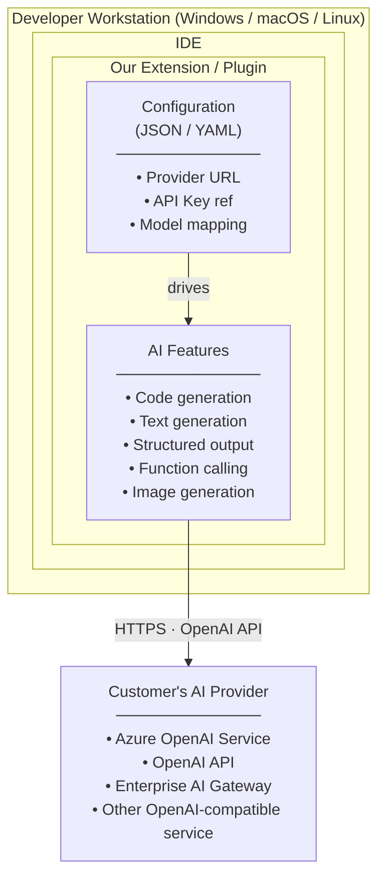
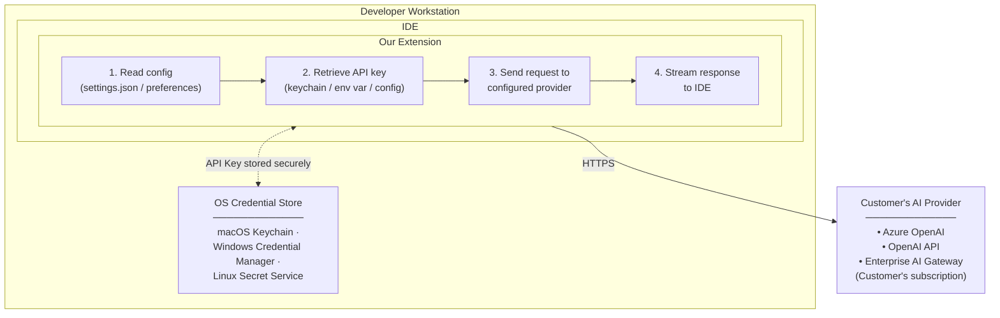
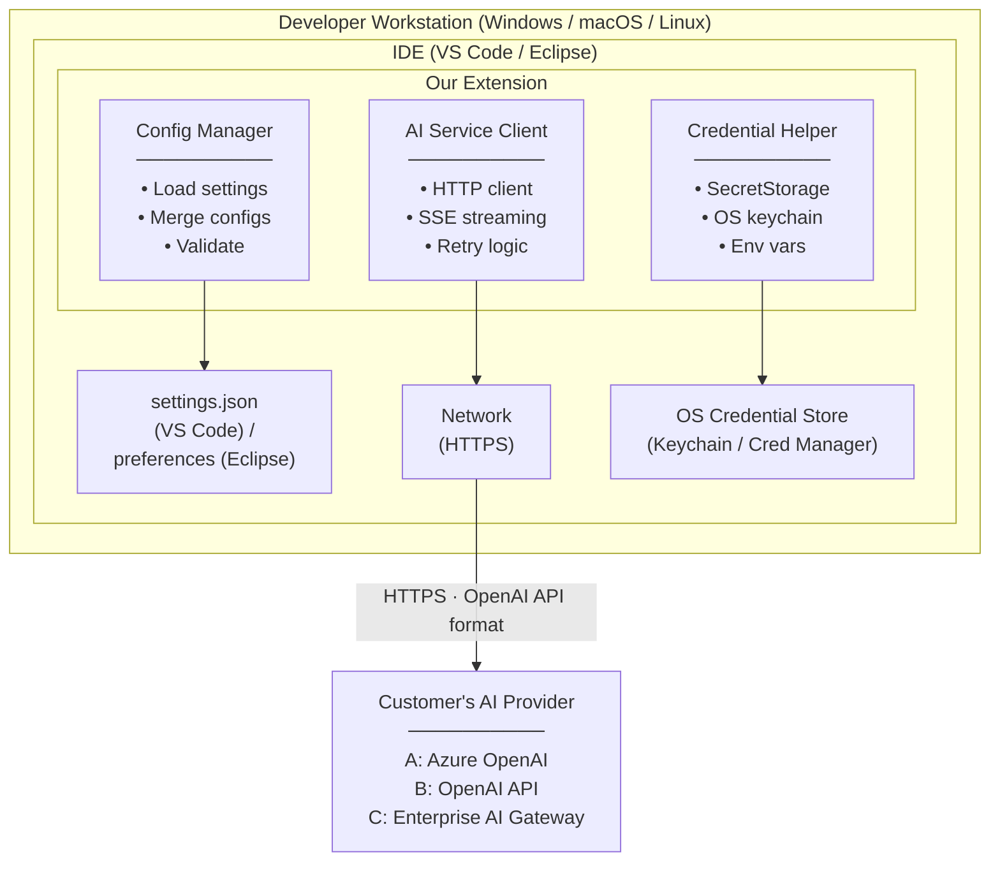
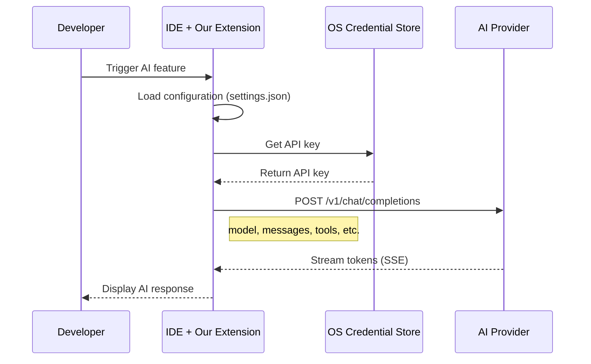
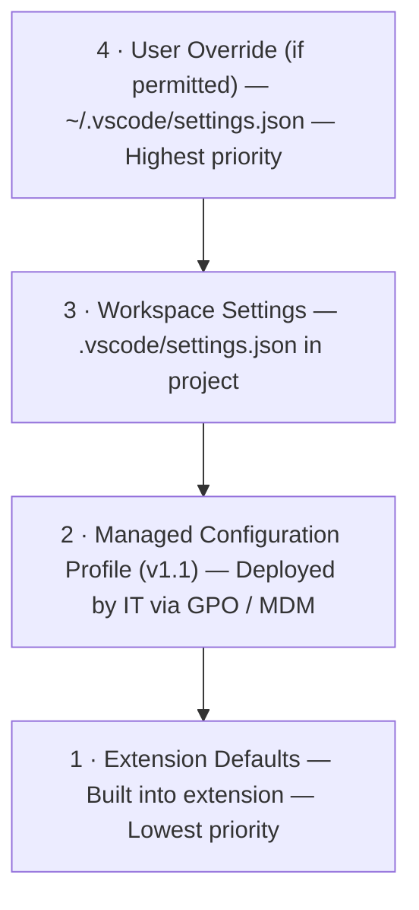
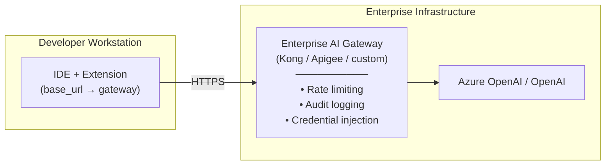
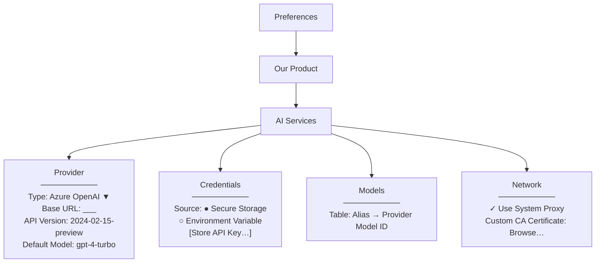
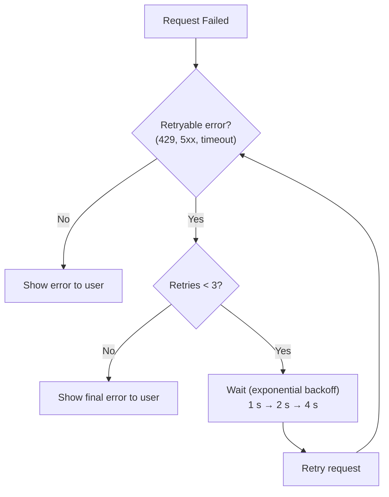
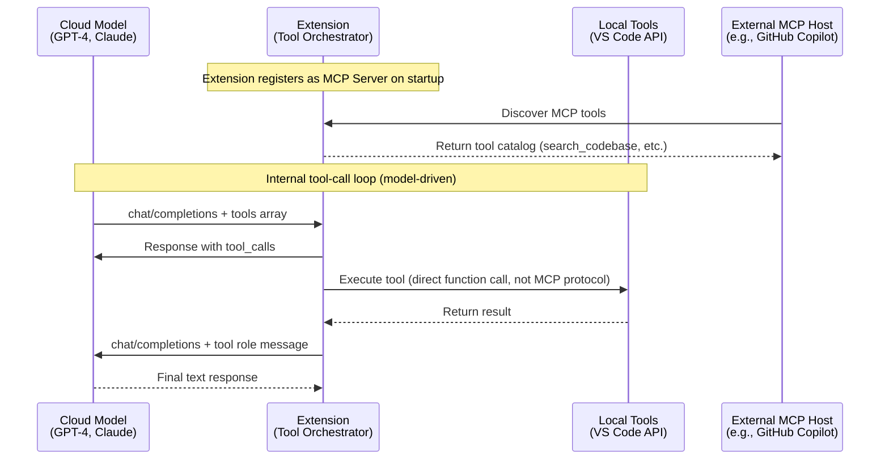

# Appendix C: Analysis Models

This appendix contains all system architecture diagrams, data flow models, and visual representations extracted from the requirements specification.

---

## C.1 Deployment Model

This diagram illustrates the high-level deployment context where the extension runs on developer workstations and communicates directly with customer-configured AI providers.



**Context:** This "zero-infrastructure" evaluation path enables prospects to go from installation to first AI interaction in minutes, not weeks—removing a common deal blocker in enterprise sales cycles.

---

## C.2 Data Flow Architecture

This diagram shows how data flows through the extension, with credentials stored securely in OS-level credential stores and all AI traffic going directly to the customer's provider.



**Security**: The vendor (us) never sees customer prompts, completions, or API keys. All data flows directly between the developer's workstation and their configured provider.

---

## C.3 Component Overview

This diagram illustrates the internal architecture of the extension, showing the key components and their interactions.



**Key Components:**
- **Config Manager**: Loads, merges, and validates configuration from settings files
- **AI Service Client**: Universal LLM Client implementing OpenAI-compatible wire protocol with streaming and retry logic
- **Credential Helper**: Manages API key retrieval from SecretStorage, OS keystores, or environment variables

---

## C.4 Request Flow Sequence

This sequence diagram shows the complete flow of a typical AI request, from user invocation through streaming response display.



**Flow Details:**
1. Developer triggers an AI feature (e.g., code generation, chat)
2. Extension loads configuration from settings
3. Extension retrieves API key from secure storage
4. Extension sends HTTPS request to configured provider
5. Provider streams response tokens via Server-Sent Events
6. Extension displays streaming response in IDE UI

---

## C.5 Configuration Hierarchy

This diagram illustrates the multi-level configuration system, showing how settings are merged with precedence rules.



**Configuration Precedence:**
- **Level 4** (Highest): User-specific overrides in global settings
- **Level 3**: Workspace-specific settings (project-level)
- **Level 2**: Managed configuration deployed by IT (v1.1 feature)
- **Level 1** (Lowest): Built-in extension defaults

**Note**: In v1.0, levels 1, 3, and 4 are implemented. Level 2 (managed configuration) is deferred to v1.1.

---

## C.6 Enterprise AI Gateway Pattern

This diagram shows the optional enterprise AI gateway pattern, where customers deploy a central gateway for governance and observability.



**Enterprise Gateway Benefits:**
- **Rate limiting**: Enforce usage quotas across organization
- **Audit logging**: Complete request/response logging for compliance
- **Credential injection**: Centralized credential management
- **Policy enforcement**: Content filtering, model selection policies
- **Cost tracking**: Charge-back to business units

**Zero-Code-Change Transition**: Moving from direct SaaS access to enterprise gateway requires only changing the `base_url` configuration—no code changes to the extension.

---

## C.7 Eclipse Preferences UI Structure

This diagram shows the hierarchical structure of the Eclipse preferences UI for AI configuration.



**UI Organization:**
- **Provider**: Base configuration (endpoint, type, auth mode)
- **Credentials**: API key source and storage options
- **Models**: Model aliasing table (friendly name → provider model ID)
- **Network**: Proxy and certificate configuration

---

## C.8 Error Handling & Retry Strategy

This flowchart shows the extension's retry logic for transient errors.



**Retry Policy:**
- **Retryable errors**: HTTP 429 (rate limit), 5xx (server error), network timeout
- **Non-retryable errors**: HTTP 401 (auth), 403 (forbidden), 400 (bad request)
- **Max retries**: 3 attempts
- **Backoff strategy**: Exponential (1s, 2s, 4s)
- **Respect Provider Signals**: Honor `Retry-After` header if present

**Error Sanitization**: Provider error messages are sanitized before display to remove internal URLs, resource identifiers, and API key patterns (REQ-UX-009).

---

## C.9 Model Context Protocol (MCP) Tool Execution Flow

This diagram illustrates the dual MCP role architecture: MCP Server registration for external consumers + internal tool-call orchestration loop.



**Key Points:**
- **Dual Role**: Extension is both MCP Server (for external hosts) and tool-call orchestrator (for internal use)
- **Direct Execution**: Internal orchestrator uses direct function calls for performance, not MCP serialization
- **Stateless Execution**: Model is the planner, extension is the executor—no local agent runtime
- **Risk Classification**: Tools classified as `safe`, `read-only`, `write-only`, `destructive` with permission model

---

## C.10 Configuration Schema Migration

This table shows how configuration settings are migrated across major versions:

| Version | Schema Version | Migration Path | Deprecated Settings |
|---------|----------------|----------------|---------------------|
| v0.x | Legacy | N/A (pre-release) | N/A |
| v1.0 | 1.0 | Automatic from v0.x | `ai.apiKey` (moved to SecretStorage) |
| v1.1 | 1.1 | Supports v1.0 and v0.x | TBD |
| v2.0 | 2.0 | Supports v1.1 and v1.0 | TBD |

**Backward Compatibility**: Extension supports settings from previous 2 major versions with automatic migration and deprecation warnings.

---

## C.11 Thread ID & Event-Typed Streaming Model

This conceptual model shows the architectural hedges for future agent framework integration:

```
Conversation Session
├── thread_id: UUID v4 (in-memory correlation ID)
├── Streaming Layer (event-typed)
│   ├── Event: token (content: "Hello")
│   ├── Event: tool_call (function: search_codebase, args: {...})
│   ├── Event: tool_result (result: [...])
│   ├── Event: status (status: "Thinking...")
│   └── Event: error (error: "Rate limited")
└── ToolOrchestrator Interface (replaceable)
    ├── v1 Implementation: Iterative loop (Chat Completions tool_calls)
    └── Future: LangGraph orchestrator or agent endpoint
```

**Future-Proofing Goals:**
- **Modular orchestrator**: Behind interface for easy replacement
- **Thread IDs**: Maps to LangGraph thread concept for future state management
- **Typed events**: Extensible without breaking streaming contract
- **Multi-step UX**: UI prepared for complex agent workflows

---

[← Previous](appendix-b-glossary.md) | [Back to main](../ai-client-srs.md) | [Next →](api-patterns.md)
